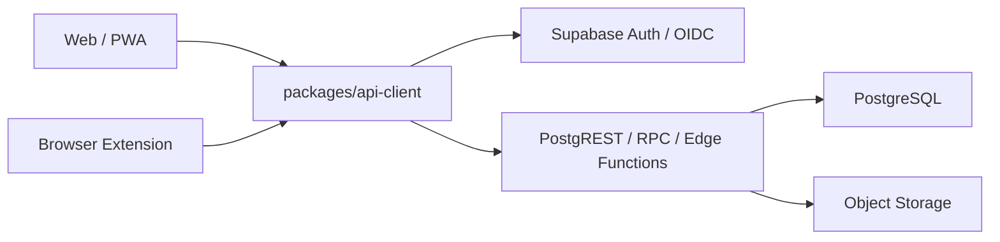

# DealPilot 系统架构设计 V2.1：Web 与云端优先

> 状态：当前有效架构
> 日期：2026-08-03
> 产品需求：[DealPilot PRD V2.1](./DealPilot_PRD_V2.1_WebCloud.md)
> 云端计划：[cloud-multiplatform-refactor-plan.md](./cloud-multiplatform-refactor-plan.md)
> 数据字典：[PostgreSQL 数据字典 V2.1](./DealPilot_PostgreSQL_数据字典_V2.1.md)

## 1. 架构结论

DealPilot 采用 Web/PWA + 云端模块化单体 + PostgreSQL 的单一后端架构。

云端开发、测试和生产使用同一套托管 Supabase 架构；开发者电脑只运行 Web/PWA 的 Vite 前端服务，直接连接受控 Supabase 开发项目。环境之间只替换服务地址、密钥和运行配置，不替换业务后端边界，也不维护本地 PostgreSQL/Supabase 业务实例。

当前工作树不包含旧 Agent 或 V1 Web，当前产品也不提供 SQLite 迁移、快照读取或本地回退入口。旧实现仅保存在 `v1-local-final` Git tag 中，不参与 demo、开发或生产数据流。

## 2. 运行拓扑



### 2.1 云端开发环境

- Supabase 开发项目提供 PostgreSQL、Auth、Storage 和 Functions 依赖。
- Web/PWA 使用开发项目 URL 和测试账号；开发者电脑只运行 Vite 前端服务。
- 所有表、RLS、复合外键、RPC、Edge Function 和 Storage 策略通过 CI migration 门禁重建并部署到开发项目。
- 测试数据只能使用合成数据或不可逆匿名化数据。
- 不启动 Docker、本地 PostgreSQL、桌面 exe、托盘、系统通知或安装器作为业务验收前置条件。

### 2.2 云端环境

- Web/PWA 部署静态前端；Supabase/PostgreSQL、Storage、Auth 和 Functions 部署受控环境。
- 环境变量只提供服务地址、公开 anon key 和非敏感配置；`service_role` 只存在于受限服务端任务。
- 测试和生产 migration 从同一仓库、同一顺序执行。
- 云端运行不依赖开发者电脑、SQLite、Agent 或浏览器扩展本地端口。

## 3. 模块化单体边界

模块保持三层依赖方向：

```text
HTTP / Edge adapter
        -> application service
        -> repository/query port
        -> PostgreSQL adapter
```

模块划分：

- Identity/Profile：账号、会话和用户设置；首版不提供自助删除账号。
- Customer：客户、联系人、社媒账号、详情、软删除、恢复和合并。
- Engagement：跟进记录和消息标记。
- Project：项目、阶段、风险和里程碑。
- Reminder：提醒状态、排序权重、处理记录和通知摘要。
- Import/Export：CSV/XLSX 映射、重复处理和导出。
- Backup/Restore：云端备份、完整性校验和原子恢复。
- Audit：请求、导入、备份恢复、删除和安全操作的脱敏审计记录。

模块之间只能调用导出的应用服务或查询服务，禁止跨模块直接访问 Repository 或数据库表。

## 4. 数据与安全

- 每张业务表都带 `owner_user_id`，默认值为 `auth.uid()`。
- RLS 是第一层授权；应用服务的资源归属检查是第二层授权。
- 父子表使用 `(owner_user_id, id)` 复合外键，阻止跨账号引用。
- 运行角色不能 `BYPASSRLS`；migration 使用独立高权限角色。
- Storage 路径以用户 ID 为第一段，策略与业务表归属一致。
- 成功响应为 `{ data }`；失败响应为 `{ error: { code, message, fields?, request_id } }`；`204` 无响应体。
- 所有响应在 API 客户端边界用运行时 schema 解析；未解析结构不得进入 UI 缓存。
- 日志不记录令牌、密码、消息正文、完整邮箱或完整手机号。

## 5. 客户端边界

`packages/api-client` 是 Web、PWA、mobile 和 extension 的唯一网络入口，负责：

- Auth/OIDC 会话和刷新。
- 请求取消、超时和重试策略。
- 公共响应包络和错误归一化。
- Zod/运行时 schema 解析。
- `request_id` 透传和幂等键。

业务组件禁止直接 `fetch`、直接调用 Supabase client 或手写 wire type。跨端共享的类型来自 `packages/shared` 和 API schema。

## 6. Customer 事务边界

- 创建、更新、软删除、恢复和合并由 Customer 应用服务调用受保护 RPC 或事务函数。
- 删除时记录提醒状态快照；恢复只恢复该删除动作改变且未被后续操作覆盖的状态。
- 合并必须迁移联系人、社媒账号、项目、跟进、提醒和关联摘要；冲突由客户端显式提交解析结果。
- 任何中途失败都必须回滚全部写入，并留下可审计 request ID。

## 7. Schema 变更与数据恢复

- PostgreSQL schema 只通过仓库中的前向 migration 演进，并从空库和上一发布版本两条路径验证。
- migration 必须保持上一兼容 Web/Edge/API 版本可读，不使用 `down`、`reset` 或快照覆盖作为应用发布回滚。
- CSV/XLSX 导入是当前唯一的批量业务数据写入入口，由浏览器完成解析预览并通过事务 RPC 提交，`import_jobs` 记录幂等结果。
- 云备份恢复必须校验格式版本、密文完整性、账号所有权和记录摘要，全部校验通过后才允许在单一事务中提交。
- 当前产品不读取 SQLite 文件、V1 bundle 或本地业务快照。

## 8. 当前明确不建设

- 桌面壳、`dealpilot-agent.exe`、NSIS 安装器和桌面快捷方式。
- 系统托盘、开机自启、Windows 系统通知和 Explorer 重启恢复。
- Agent 业务 API、SQLite 运行时主库、V1 数据迁移和 PostgreSQL/SQLite 双写。
- 当前工作树中的 V1 Web、Agent provider、EXE/NSIS 构建链和 Native Messaging host。
- 团队 workspace、成员角色、邀请、共享客户和企业 SSO。
- 微服务拆分、Kubernetes 和第二套云端 CRUD API。
- 封闭预览的自定义 SMTP 与公开邮件投递 SLA；认证模块仍保留标准注册和密码重置接口，开放前另行配置和验收邮件服务。
- 整项目 Supabase 基础设施灾备编排及 RPO/RTO 承诺；当前 Backup/Restore 模块只负责账号内用户级加密备份和原子恢复。
- 浏览器扩展商店自动提交；CI/Release 只交付候选 ZIP，真实平台 UAT 与商店操作由产品所有者执行。

## 9. 架构验收

本地验收必须在 Supabase/PostgreSQL 实例完成：

- 空库 migration、RLS、复合外键、Storage、RPC 和 Edge Function 测试。
- 两个测试账号的隔离矩阵、伪造归属和跨账号父子引用测试。
- Customer 行为等价、CSV/XLSX 导入导出、提醒和云备份恢复 E2E。
- API 客户端成功/失败包络、字段错误、网络/取消、过期会话和不可解析 2xx 测试。
- `type-check`、`lint`、单元测试、构建和浏览器 E2E 全部通过。
- `pnpm audit:retirement` 通过，证明旧运行时路径和引用没有重新进入当前工作树。

历史 V1 文档：[外贸经理个人工作台_PRD_V1.5.md](./外贸经理个人工作台_PRD_V1.5.md)、[外贸经理个人工作台_系统架构设计_V1.3.md](./外贸经理个人工作台_系统架构设计_V1.3.md)。
