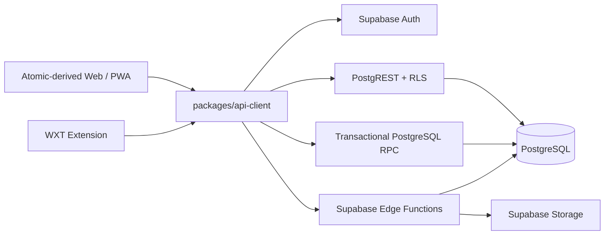

# DealPilot 基于 Atomic CRM 的个人云改造计划

> 状态：生产环境持续验收中，尚未达到全部完成定义
> 日期：2026-08-04
> 目标版本：V2.1
> 产品决策：`docs/DealPilot_PRD_V2.1_WebCloud.md`
> 当前架构决策：`docs/adr/ADR-V2-002-atomic-crm-personal-cloud.md`

## 1. 决策摘要

DealPilot 采用固定版本的 [Atomic CRM](https://github.com/marmelab/atomic-crm) 作为 Web/PWA 与 Supabase/PostgreSQL 基线。当前产品是个人云 CRM，不提供团队 workspace、成员、角色、邀请或企业 SSO；不同账号仍必须通过 RLS、复合外键和 Storage policy 严格隔离。

云端优先表示开发、demo 和生产使用同一套托管 Supabase 运行模型。本机只运行 Vite 前端；环境之间只替换 URL、公开密钥和受控服务端 secret。PostgreSQL 从账号创建起就是唯一业务事实源，不提供 SQLite 数据迁移、本地业务后端、双写或本地回退模式。

当前代码资产：

- `apps/cloud`：唯一 Web/PWA 产品入口。
- `apps/extension`：浏览器扩展入口，通过同一云端客户端访问数据。
- `packages/api-client`：Web/PWA/Extension 唯一业务网络边界。
- `packages/shared`：共享 schema、枚举和纯业务规则。
- `supabase/`：PostgreSQL schema migration、RLS、RPC、Edge Functions、Storage policy 和数据库测试。
- `apps/web`、`apps/agent`、`packages/migration`、EXE/NSIS、托盘、Native Messaging 和 SQLite 运行链均已退役；历史代码仅保存在 Git 历史或归档 tag 中。

## 2. 目标与非目标

### 2.1 目标

- 使用 Supabase Auth 管理身份；封闭预览只承诺受控账号登录和会话，保留但不验收公共注册/密码重置邮件投递；首版不提供自助删除账号。
- 使用 `owner_user_id = auth.uid()` RLS、用户内唯一约束和复合外键隔离账号数据。
- 实现 Customer 列表、搜索、创建、详情、更新、软删除、恢复和合并的完整闭环。
- Customer 详情包含联系人、社媒账号、项目/商机、跟进和提醒摘要。
- 实现项目、风险、里程碑、跟进、提醒、Dashboard 和扩展会话匹配。
- 保留 CSV/XLSX 字段映射、预览、逐行错误、重复候选和事务提交；`import_jobs` 记录幂等结果。
- 支持数据导出、加密云备份、完整性校验和原子恢复。
- Web、PWA 和扩展只通过类型化客户端访问云端业务数据。

### 2.2 非目标

- 不支持团队协作、共享客户、workspace 切换或企业 SSO。
- 不引入 NestJS、Keycloak、微服务、Kubernetes 或第二套 CRUD API。
- 不提供 V1 SQLite 数据迁移、Agent API、本地 PostgreSQL 产品模式或云端到本地同步。
- 首版不建设 Capacitor、原生移动应用、托盘、系统通知或浏览器关闭后的通知。
- 不建设整项目 Supabase 基础设施灾备或承诺 RPO/RTO；账号内用户级加密备份和原子恢复继续保留。
- 扩展商店提交/审核和真实 WhatsApp/Telegram 页面兼容性由产品所有者单独 UAT，不阻塞 WebCloud 核心发布。
- 不自动发送、修改、删除或批量抓取社媒消息。

## 3. 目标架构

职责约束：

- React 页面只负责呈现和交互，不直接调用 `fetch` 或 Supabase SDK。
- 网络 JSON 以 `unknown` 接收并在 `packages/api-client` 使用 Zod 解析。
- 普通 CRUD 使用受 RLS 保护的 PostgREST；跨表写操作使用单个原子 RPC 或 Edge Function。
- Customer 合并、软删除、恢复、提醒联动、CSV/XLSX 导入和云备份恢复不得产生部分写入。
- 客户端永远不能获得 `service_role`；日志不得记录令牌、密码、完整消息正文或不必要的客户敏感字段。

## 4. Customer 硬门槛

Customer 纵向切片必须同时满足：

- 列表、搜索、过滤、稳定排序、游标分页、创建、详情和更新。
- 软删除、30 天内恢复、期满清理及删除/恢复时的提醒状态联动。
- 合并时显式解决字段冲突，并迁移联系人、社媒账号、项目、跟进和提醒关联。
- 详情返回联系人、社媒账号、项目、最近跟进和开放提醒摘要。
- 合并、删除、恢复和清理在数据库事务与 durable queue 边界内保持一致。
- Web 页面只使用 `packages/api-client`/DataProvider；契约错误能归一化并显示安全提示。
- 两个真实测试账号的浏览器、PostgREST、RPC、Storage、Edge 和复合外键隔离矩阵通过。

该门槛通过前不宣称云端产品完成，也不以 demo 数据或纯单元测试替代真实 Supabase 验收。

## 5. 分阶段实施

| 阶段               | 主要工作                                                          | 退出条件                                      | 原始估算 |
| ------------------ | ----------------------------------------------------------------- | --------------------------------------------- | -------: |
| G0 决策收口        | 固定 Atomic CRM、个人云和 PostgreSQL 唯一事实源；退役本地链路     | PRD、架构、ADR、目录和 CI 门禁无冲突          |   1-2 天 |
| P1 Cloud 基线      | 固定上游 commit；接入 monorepo、Supabase 开发项目和 CI            | 受控账号登录及基础 CRM 运行，构建测试通过     |   3-4 天 |
| P2 账号隔离        | profile、`owner_user_id`、RLS、复合外键和 Storage policy          | 双账号隔离、直接 RLS 与跨账号引用测试通过     |   5-8 天 |
| P3 Customer 硬门槛 | 类型化客户端、完整 Customer 行为、关联详情和原子命令              | 第 4 节全部通过                               |  8-12 天 |
| P4 领域与数据管理  | 项目、风险、里程碑、跟进、提醒、Dashboard、CSV/XLSX、导出和云备份 | 领域 E2E、1000 行导入、备份恢复与规模门禁通过 |  7-10 天 |
| P5 扩展与 PWA      | 会话匹配、人工绑定、单条消息跟进、PWA 安装和离线应用壳            | 候选包门禁通过；真实平台由产品所有者 UAT      |   3-5 天 |
| P6 云端发布        | 受控身份、隐私、监控、灰度、用户备份、管理员清理和应用回滚        | WebCloud 核心发布门与演练证据完整             |   3-4 天 |

原始单人全职规划基准调整为约 7-11 个开发周，不包含真实用户试点等待、浏览器商店审核、跨境数据合规和上游重大升级。当前阶段以剩余验收证据为准，不再按原始工期推断完成度。

## 6. 当前进度

| 阶段 | 当前状态   | 已有证据                                                                                                                              | 剩余门槛                                               |
| ---- | ---------- | ------------------------------------------------------------------------------------------------------------------------------------- | ------------------------------------------------------ |
| G0   | 已完成     | Cloud-only 目录、产品文档和退役 CI 门禁                                                                                               | 无                                                     |
| P1   | 已验收     | Atomic 基线、中文界面、统一构建测试；受控账号登录/会话、真实注册确认回调均已通过                                                      | 无；公共邮件投递不在封闭预览范围                       |
| P2   | 已验收     | RLS、复合外键、Storage、双账号 SQL/browser 门禁及 Hosted Preview 双账号复跑                                                           | 无                                                     |
| P3   | 已验收     | Hosted Preview 真实账号完成 Customer CRUD、关联详情、合并、删除/恢复与提醒联动                                                        | 无                                                     |
| P4   | 部分验收   | 领域界面、1000 行导入门禁、Hosted CSV 持久化与隔离 XLSX 导出、加密云备份、Hosted P0 全业务域 E2E 及托管备份恢复                       | 托管项目规模复跑                                       |
| P5   | 工程已验收 | PWA manifest/SW/离线壳、扩展单测、Chrome/Edge 双包和商店候选包门禁                                                                    | 产品所有者执行真实 WhatsApp/Telegram UAT；商店分发可选 |
| P6   | 部分验收   | preview/canary/production 发布、生产认证 smoke、15 分钟健康监控、数据保留调度、用户级加密备份恢复、受控管理员清理、密钥轮换及应用回滚 | 合规、隐私、跨境及供应商评审                           |

### 6.1 已完成的生产验收证据

- 2026-08-04 使用一次性真实邮箱完成生产注册；确认邮件的 `redirect_to` 精确为 `https://round123.github.io/dealpilot/auth-callback.html`，实际点击后回调页可达且确认账号能够登录生产工作台。
- Hosted Preview 的 Customer、项目、风险、里程碑、跟进、提醒和 Dashboard P0 流程已由 [`preview-hosted.spec.ts` 完整复跑](https://github.com/round123/dealpilot/actions/runs/30876618013)并通过。
- Hosted Preview 的加密备份下载、快照账号隔离、普通恢复、上传预检和加密恢复已由 [`preview-hosted.spec.ts` 完整复跑](https://github.com/round123/dealpilot/actions/runs/30878881028)并通过；同一提交的 [CI](https://github.com/round123/dealpilot/actions/runs/30878883739)同时通过本地 PostgreSQL 备份恢复、账号隔离及浏览器/API 隔离门禁。
- 生产上一兼容应用版本已由 [Roll back WebCloud application](https://github.com/round123/dealpilot/actions/runs/30812975250)完成回滚演练，当前 PostgreSQL schema 保持可读。
- 注册测试账号通过 Issue [#11](https://github.com/round123/dealpilot/issues/11) 审批，并由 [Controlled administrator account cleanup](https://github.com/round123/dealpilot/actions/runs/30868224588) 永久清理；工作流完成后再次通过 Auth Admin API 确认账号不存在。
- 首次真实生产基础设施备份已由 [Disaster recovery backup](https://github.com/round123/dealpilot/actions/runs/30822849928) 成功生成仅包含 `.tar.age` 的受保护 artifact；该可选运维证据不构成首版 RPO/RTO 承诺。
- 生产数据库密码已轮换并同步更新生产发布与运维环境 secret。

### 6.2 仍不得宣称完成的发布门槛

- 当前按封闭预览交付，不承诺公开注册确认和密码重置邮件投递；未来开放公共注册前必须配置自定义 SMTP 并重新验收。
- 整项目基础设施恢复和 RPO/RTO 已移出首版范围；不得将已有备份 artifact 表述为已验证的灾备能力。
- 1000 Customer / 10000 follow-up 的托管 Preview 规模工作流必须在合入 `main` 后实跑并留存四项查询指标；当前仅有本地事务回滚基线，不得据此宣称托管规模门槛通过。
- 合规、隐私、跨境和供应商评审仍需留存外部证据；真实 WhatsApp/Telegram 与 Chrome/Edge 商店结果由产品所有者单独记录，不阻塞 WebCloud 核心发布。

## 7. 测试与质量门禁

- `lint`、`type-check`、单元测试、构建和相关 E2E 全部通过。
- PostgreSQL migration 可从空库执行，也可从上一发布版本向前升级。
- RLS、复合外键、RPC、Storage policy 和 Edge Function 使用两个账号验证。
- API 客户端覆盖成功、字段错误、非 JSON 错误、网络/取消、过期会话和不可解析 2xx。
- Customer 覆盖列表、搜索、分页、详情、合并、删除、恢复及提醒联动。
- CSV/XLSX 覆盖映射、逐行错误、重复处理、1000 行提交、失败回滚和幂等重试。
- 云备份覆盖加密完整性、版本兼容、错误密码/篡改、账号隔离和原子恢复。
- PWA 覆盖 manifest、Service Worker 和离线应用壳；扩展 CI 覆盖适配器与仅单条主动标记，真实平台 DOM 由产品所有者 UAT。
- CI 必须拒绝 `apps/web`、`apps/agent`、`packages/migration`、V1 本地 API、SQLite 产品入口和安装器链回流。

## 8. 发布与回滚

1. PostgreSQL 始终是唯一业务事实源。
2. schema migration 只前向演进，并保持上一兼容 Web/Edge/API 可读取当前 schema。
3. 应用发布失败时回滚上一兼容应用版本，不执行数据库 `reset`、`down` 或快照覆盖。
4. CSV/XLSX 导入失败不得留下部分业务记录；幂等重试返回同一任务结果。
5. 云备份恢复必须先校验版本、摘要、账号和行数，再原子提交。
6. Customer 软删除保留 30 天；首版不提供自助删号，备份保留遵循发布前确认的隐私与删除 SLA。
7. 上游 Atomic CRM 升级与业务发布分开执行，不在故障回滚时夹带上游升级。

## 9. 主要风险

| 风险                 | 影响                     | 控制措施                                    |
| -------------------- | ------------------------ | ------------------------------------------- |
| Atomic 默认宽松 RLS  | 账号间数据泄露           | 逐表 owner policy、复合外键和双账号矩阵     |
| 跨表写由前端编排     | 部分更新和数据丢失       | 单个 PostgreSQL RPC/Edge 命令和事务回滚测试 |
| Supabase 调用散落    | 契约漂移且难测试         | 唯一 API Client/DataProvider 与 ESLint 门禁 |
| `service_role` 泄漏  | 绕过全部 RLS             | 仅服务端 secret、构建扫描和最小授权         |
| 托管环境验收不足     | CI 通过但生产失败        | 开发项目、canary 和 production 分级验收     |
| PWA/扩展依赖真实平台 | DOM 或浏览器更新导致回归 | 真实浏览器矩阵、商店合规和受控灰度          |

## 10. 完成定义

- 封闭预览受控账号的登录和会话通过真实环境验收；公共注册/密码重置邮件投递不在当前完成定义，自助删号保持关闭。
- 不同账号无法通过任何受支持入口访问彼此数据。
- Customer 与所有 P0 业务域、CSV/XLSX 导入、数据导出和云备份恢复通过 E2E。
- Web、PWA 和扩展使用同一类型化云端客户端。
- PWA 离线应用壳和扩展候选包通过工程门禁；真实 WhatsApp/Telegram 由产品所有者 UAT，不承诺离线业务写入或浏览器关闭后的系统通知。
- 用户级备份恢复、日志脱敏、依赖扫描、灰度发布和上一兼容应用回滚演练通过；整项目灾备和 RPO/RTO 不在首版范围。
- 当前代码树不存在第二套 V1 CRM、SQLite 数据迁移包或本地业务运行模式。
