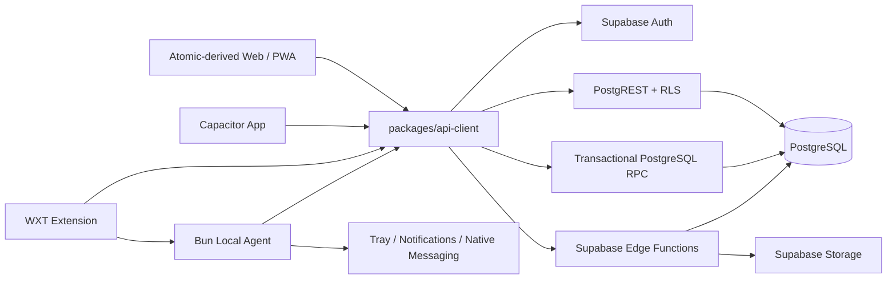

# DealPilot 基于 Atomic CRM 的个人云改造计划

> 状态：实施中；G0A 已完成，P1/P2 已完成代码基线但等待本地 Supabase 数据库门禁，P3 进行中
> 日期：2026-07-31
> 目标版本：V2
> V1 基线：`codex/pragmatic-three-layer`
> 产品决策：`docs/DealPilot_PRD_V2_G0.md`
> 当前架构决策：`docs/adr/ADR-V2-002-atomic-crm-personal-cloud.md`

## 1. 决策摘要

DealPilot V2 采用 [Atomic CRM](https://github.com/marmelab/atomic-crm) 作为云端 Web/PWA 和 PostgreSQL 数据模型的开源基线，不再新建 NestJS 云端 API。Atomic CRM 使用 MIT 许可证，技术栈为 React、Vite、Supabase/PostgreSQL、React Admin、TanStack Query、Zod 和 PWA，与 DealPilot 现有 React/Vite/TypeScript 工具链相近，并已提供联系人、公司、任务、提醒、笔记、交易、导入导出、联系人合并和活动历史等能力。

V2 是个人云 CRM，不提供团队 workspace、成员、角色和邀请。每个账号只能访问自己的业务数据；同一账号可在 Web、PWA、移动端、浏览器扩展和本地 Agent 间访问同一份数据。这里取消的是团队型多租户产品结构，不取消公共云中不同用户之间必须具备的数据隔离。

现有 DealPilot 不废弃：

- V1 Agent、SQLite、测试和 `apps/web` 源码是迁移来源、行为基线和确认前的数据回退依据；`apps/web` 不再作为 Agent 默认运行 UI。
- Atomic CRM 派生应用作为新的 `apps/cloud` 并行建设。
- P3 Customer 硬门槛通过前，不删除或重命名现有 `apps/web` 源码，也不停止由 Atomic 前端 + Agent/SQLite 承载的本地业务模式。
- 用户确认迁移后，PostgreSQL 永久成为该账号的唯一业务事实源；SQLite 仅保留为只读迁移快照。

## 2. 目标与非目标

### 2.1 目标

- 复用 Atomic CRM 的现代 Web/PWA、联系人、公司、任务、交易、活动、导入导出和响应式能力。
- 使用 Supabase Auth 管理注册、登录、邮箱验证、密码重置和会话，不在 DealPilot 中存储密码。
- 使用 PostgreSQL RLS 和数据库约束实现严格的按用户数据隔离。
- 保持 Customer 列表、搜索、创建、详情、更新、软删除、恢复和合并与 V1 行为等价。
- Customer 详情继续包含联系人、社媒账号、项目/商机、跟进和提醒摘要。
- 保留 DealPilot 的项目、风险、里程碑、跟进、提醒和平台账号匹配能力。
- Web/PWA、移动端和浏览器扩展通过同一个类型化客户端访问云端。
- Agent 最终只负责 SQLite 迁移、托盘、系统通知和 Native Messaging。
- 迁移可预检、可重试、可核对，确认前可撤销；确认后不建设 PostgreSQL 到 SQLite 的反向同步。

### 2.2 非目标

- V2 首版不支持团队、共享客户、成员角色、workspace 切换或企业 SSO。
- 不引入 NestJS、Keycloak、Drizzle PostgreSQL、微服务、Kubernetes 或长期双写。
- 不把 Atomic CRM 原样上线；其默认全员共享数据策略必须先改造。
- 不强制所有普通 CRUD 都经过自建代理 API；PostgREST 可作为受 RLS 保护的传输层。
- 不在 P3 前启动 Capacitor、应用商店发布或其他领域的批量迁移。
- 不追求与 Atomic CRM 上游持续无冲突同步；只按固定版本评估并选择性吸收上游更新。

## 3. 代码资产处理

| 资产 | 处理方式 | 说明 |
|---|---|---|
| `apps/cloud` | 新增 | 引入固定 commit 的 Atomic CRM 派生应用，承载 V2 Web/PWA |
| `apps/web` | 仅保留源码行为基线 | 已冻结功能开发且不再作为 Agent 默认入口或安装包输入；P7 从活动代码树删除，历史实现由 `v1-local-final` 标签保留 |
| `apps/agent` | 保留并逐步瘦身 | 保留迁移、托盘、通知、Native Messaging；确认后不再承担主业务 API |
| `apps/extension` | 保留并改造 | 保留页面识别、匹配和快捷录入；由本地 API 切换到云端客户端 |
| `packages/shared` | 选择性保留 | 业务枚举、Zod schema、格式化、迁移类型和纯业务规则继续复用 |
| `packages/api-client` | 新增 | 包装 Supabase Auth、PostgREST、RPC、Edge Functions、运行时解析和统一错误 |
| `supabase/` | 新增 | schema、migration、RLS、数据库函数、Edge Functions、Storage 和本地配置 |
| V1 SQLite 与测试 | 保留 | 迁移源、行为基准、快照与迁移确认前回退依据 |

目标目录：

```text
apps/
  cloud/                 # Atomic CRM 派生的 V2 Web/PWA
  web/                   # V1 本地 Web，P3 前保留
  agent/                 # SQLite 迁移与本机能力
  extension/             # WXT 浏览器扩展
  mobile/                # P3 后增加的 Capacitor 壳
packages/
  api-client/            # 唯一云端网络边界
  shared/                # 纯业务类型、schema、枚举和工具
supabase/
  migrations/            # PostgreSQL schema、约束、RLS、函数
  functions/             # 迁移、设备配对、账号删除等编排
  tests/                 # 数据库和安全集成测试
```

Atomic CRM 上游代码进入仓库时必须记录仓库 URL、commit SHA、引入日期和 MIT 许可证，并保留版权声明。升级只允许从一个固定 commit 升到另一个固定 commit，先生成差异报告，再运行全部门禁。

## 4. 目标架构



### 4.1 职责边界

- React 页面只负责呈现和交互，通过 React Admin resource、TanStack Query hook 或 feature service 调用 `packages/api-client`。
- `packages/api-client` 是唯一允许直接依赖 `@supabase/supabase-js` 的业务网络层；`apps/cloud` 通过 ESLint 禁止业务代码直接导入 Supabase SDK 或调用全局 `fetch`，Gravatar、favicon、头像和 blob-source 等非业务媒体流集中到精确放行的非 React helper。
- 普通单表 CRUD 使用 PostgREST，但必须在客户端边界完成 Zod 解析和错误归一化。
- 合并、软删除、恢复、迁移提交和账号删除等跨表操作必须通过单个 PostgreSQL RPC 或 Edge Function 触发，并在一个数据库事务内完成。
- 纯业务规则继续放在可单元测试的 TypeScript 函数中；数据库一致性规则由约束、RLS、trigger 和事务函数兜底。
- Edge Function 负责身份校验、文件/批次编排和外部系统调用，不承载可以由数据库事务可靠完成的核心关系更新。
- 客户端永远不能获得 Supabase `service_role` 密钥。

### 4.2 网络契约

Atomic CRM 原生 DataProvider 和 PostgREST 不统一使用 `{ data }` 包络，因此 V2 将公共契约定义在 `packages/api-client` 的返回边界，而不是强制重写所有 PostgREST 响应：

- 调用者只获得已解析的领域对象或统一的 `ApiError`，不会看到 PostgREST/Supabase 原始响应。
- DealPilot 自有 RPC 和 Edge Function 的业务响应使用 `{ data }` / `{ error: { code, message, fields?, request_id } }`；PostgREST、Supabase Auth/Storage 等原生错误不强制符合该 wire envelope。
- PostgREST 的数据、计数和错误由适配器转换成同样的调用者语义。
- 网络 JSON 以 `unknown` 接收，使用 Zod 解析后才进入组件和缓存。
- `ApiError` 覆盖服务端错误、字段错误、RLS 拒绝、未认证、网络错误、取消和无法解析的成功响应；所有归一化后的 `ApiError` 都有稳定、非空的 `requestId`，优先使用服务端错误 body 中的 `request_id`，其次使用 `x-request-id` 响应 header，均缺失时由客户端生成。
- `AbortSignal` 必须从查询层传到请求边界。
- ESLint 禁止 `apps/cloud/src` 业务代码绕过 `packages/api-client`/DataProvider 直接访问网络；原始 `fetch` 只允许出现在明确列入 override 的非业务媒体 helper，不设置目录级或全局例外。

## 5. 身份与个人数据隔离

### 5.1 账号模型

- Supabase `auth.users` 是登录身份事实源。
- Atomic CRM 的 `sales` 表改造成用户资料表或由新的 `profiles` 表替代，一名 `auth.users` 用户只能拥有一个资料记录。
- V2 首版支持邮箱注册、邮箱验证、登录、密码重置和登出。
- Atomic CRM 的首位用户自动管理员、用户邀请和共享销售团队管理在个人版中禁用。
- 社交登录和外部 OIDC 作为后续可选项，不阻塞 P3；不在首版部署 Keycloak。

### 5.2 行级隔离

每张云端业务表必须包含：

```sql
owner_user_id uuid not null default auth.uid()
```

规则如下：

- SELECT/UPDATE/DELETE RLS：`owner_user_id = (select auth.uid())`。
- INSERT RLS：`owner_user_id = (select auth.uid())`；客户端不能替其他用户写入。
- 父表建立 `(owner_user_id, id)` 唯一约束。
- 子表使用 `(owner_user_id, parent_id)` 复合外键，数据库直接拒绝跨用户父子引用。
- 全局唯一值改为用户内唯一，例如社媒账号唯一约束为 `(owner_user_id, platform, normalized_identifier)`。
- RLS 未取得用户上下文时必须返回零行或拒绝写入，不能退化为全表访问。
- migration 使用独立高权限连接；浏览器、扩展和 Agent 只使用匿名 key + 用户会话。
- 后台任务若必须使用 `service_role`，必须显式携带目标 `owner_user_id`、验证任务所有权并写审计记录。

### 5.3 数据隔离验收

至少使用两个真实 Supabase 测试用户验证：

- 用户 A 无法列表、详情、更新、删除、导出或通过 RPC 访问用户 B 的数据。
- 伪造 `owner_user_id` 的 INSERT/UPDATE 被 RLS 拒绝。
- 跨用户父子 ID 即使已知也被复合外键拒绝。
- 删除或失效的会话不能继续访问 PostgREST、RPC、Storage 或 Edge Function。
- 直接 SQL 以 authenticated 角色执行时仍受 RLS 约束。
- Storage 对象路径按用户隔离，策略验证路径首段与 `auth.uid()` 一致。
- 构建产物和前端环境变量中不存在 `service_role`。

## 6. 数据模型与迁移映射

### 6.1 Atomic CRM 基线改造

| Atomic CRM 资源 | V2 用途 | 必要改造 |
|---|---|---|
| `companies` | DealPilot 客户主记录 | 增加 grade、status、source、country、deleted_at、owner_user_id |
| `contacts` | 客户下的联系人 | 保留多邮箱/电话能力，增加 owner_user_id 和复合外键 |
| `contact_notes` | 普通客户笔记 | 与跟进记录区分，增加 owner_user_id |
| `deals` | DealPilot 项目/商机 | 增加 probability、grade、closed_reason 和 owner_user_id |
| `deal_notes` | 项目笔记 | 增加 owner_user_id |
| `tasks` | 通用待办 UI 基础 | 不直接替代 DealPilot 丰富提醒；通过适配器复用部分 UI |
| `sales` | 当前用户资料 | 移除共享团队和管理员语义，或迁移为 `profiles` |
| `tags`、`configuration` | 用户标签和个人配置 | 增加 owner_user_id；configuration 不再是全局单行 |
| activity log view | 活动展示 | 合并客户创建、笔记和 DealPilot 跟进事件，但不作为唯一事实表 |

### 6.2 V1 迁移分类

| V1 表 | V2 目标 | 迁移规则 |
|---|---|---|
| `customers` | `companies` | 完整迁移；名称、公司、国家、来源、等级、状态和软删除状态保真 |
| `contacts` | `contacts` | 关联到迁移后的 company；邮箱和电话转换为 Atomic JSONB 结构 |
| `social_accounts` | 新 `social_accounts` | 完整迁移；唯一约束改为用户内唯一 |
| `projects` | `deals` | 阶段、金额、币种、概率、等级、预计关闭日和关闭原因完整映射 |
| `follow_ups` | 新 `follow_ups` | 保留类型、备注、消息正文/方向、发生时间及 customer/deal 引用 |
| `reminders` | 新 `reminders` | 保留完整状态机、优先级、通知、稍后提醒和解决结果 |
| `risks` | 新 `deal_risks` | 关联迁移后的 deal，完整迁移 |
| `milestones` | 新 `deal_milestones` | 关联迁移后的 deal，完整迁移 |
| `import_jobs` | 不迁移历史 | 云端仅为新导入和 V1 迁移创建任务 |
| `local_events` | `audit_events`/删除快照 | 不原样复制，只转换恢复和审计需要的记录 |
| `settings` | `profiles/preferences` + Agent 本地设置 | locale/theme 上云；托盘、开机启动、备份时间继续留在 Agent |

迁移顺序为：profile/preferences -> companies -> contacts -> social_accounts -> deals -> follow_ups -> deal_risks/deal_milestones -> reminders。每一批记录旧 ID、新 ID、数量、摘要和幂等键。

## 7. Customer 硬门槛

P3 不是完成 Atomic CRM 的 contacts CRUD，而是完成 V1 Customer 行为等价闭环。必须同时实现：

- 列表、搜索、过滤、分页、创建和详情。
- 更新、软删除、30 天内恢复和期满清理。
- 合并时按用户选择解决字段冲突，并重新关联联系人、社媒账号、项目/商机、跟进和提醒。
- 详情包含联系人、社媒账号、项目/商机、最近跟进和未完成提醒摘要。
- 删除客户时，将 pending/snoozed/overdue 提醒置为 ignored，并保存可恢复状态快照。
- 恢复客户时，只恢复由该次删除动作改变且此后未被其他操作覆盖的提醒状态。
- 合并、删除和恢复均在单个数据库事务内完成，失败时不允许部分更新。
- Web 云端页面使用 `packages/api-client`/DataProvider 适配器，不直接操作 Supabase。
- V1 与 V2 对同一组固定数据执行行为对照，输出差异报告。

P3 全部门禁通过前，不删除 V1 Web、不批量迁移其余领域、不启动移动端壳。

## 8. 分阶段实施

| 阶段 | 主要工作 | 退出条件 | 预估 |
|---|---|---|---:|
| G0A 决策修订 | 固定 Atomic CRM 方向；取消 NestJS/Keycloak/workspace；更新 PRD、ADR 和计划 | 文档无相互冲突的已接受决策 | 1-2 天 |
| P1 Atomic 本地基线 | 固定上游 commit；引入 `apps/cloud`；接入 pnpm/Turbo；启动本地 Supabase；保留许可证；建立 CI | Atomic 登录、联系人、公司、任务和交易可用合成数据在本机运行；构建和测试通过 | 3-4 天 |
| P2 个人账号与隔离 | 改造 profile；禁用团队管理；所有业务表增加 owner_user_id、RLS、复合约束和 Storage 策略 | 两用户隔离矩阵、直接 RLS 查询和跨用户父子引用测试全部通过 | 5-8 天 |
| P3 Customer 纵向切片 | 数据模型映射；类型化客户端；完整 Customer 行为；原子合并/删除/恢复；关联详情；V1/V2 对照 E2E | 第 7 节全部通过并签字确认 | 8-12 天 |
| P4 DealPilot 领域补齐 | 项目/商机、风险、里程碑、跟进、提醒、Dashboard、导入导出；复用 Atomic UI | V1 适用业务验收项在 V2 全部通过 | 7-10 天 |
| P5 SQLite 迁移与 Agent 瘦身 | 快照、预检、分批迁移、幂等、校验、确认；Agent 移除主业务 API 职责；V1 Web 退出运行 | 确认前可撤销；确认后 PostgreSQL 为唯一事实源；迁移演练通过；V1 不再接受功能开发或作为产品入口 | 5-7 天 |
| P6 扩展与多端 | 扩展云端登录和匹配；PWA 安装/更新；随后增加 Capacitor 壳和设备权限 | Web/PWA/扩展共用客户端；至少一个移动平台完成核心流程 | 4-6 天 |
| P7 灰度发布与 V1 退役 | 监控、限流、备份恢复、账号删除、隐私告知、试点和回滚演练；删除 V1 活动运行代码 | 生产发布门全部通过；试点迁移成功；只在 `v1-local-final` Git 标签和迁移夹具中保留 V1 | 3-4 天 |

单人全职预计约 8-13 个开发周，规划基准为 10 周。该估算不包含真实用户试点等待、应用商店审核、跨境数据合规和上游重大升级。Docker Desktop、本地 Supabase 和邮件测试服务未可用期间，P1/P2 数据库门禁不能验收。

### 8.1 当前实施进度（2026-07-31）

| 阶段 | 状态 | 已完成 | 尚未满足的退出条件 |
|---|---|---|---|
| G0A | 已完成 | PRD、Atomic 个人云 ADR、V1 最终标签和独立改造分支已建立 | 无 |
| P1 | 代码基线完成，验收阻塞 | 固定并引入 Atomic CRM；保留 MIT 和来源；接入 pnpm/Turbo；Cloud、V1 与 API 客户端可构建和测试；增加可刷新持久化的合成数据 `dev:demo` 和 GitHub Actions 质量/数据库门禁 | 本机缺少 Docker/Podman，尚未启动本地 Supabase、Auth、Storage 和邮件服务做运行验收；新增 CI 尚未在远端 Runner 实际执行 |
| P2 | 静态实现完成，运行门禁待验 | 个人 profile、团队入口移除、19 张表的 owner 隔离、RLS、复合外键、私有 Storage 和双用户 SQL 测试已入库 | migration 尚未在本地 PostgreSQL 执行；RLS、复合外键、Storage 和 RPC 隔离矩阵尚未产生真实数据库测试结果 |
| P3 | 进行中 | 单例 `packages/api-client`/React Admin DataProvider、严格 Customer 契约、结构化服务端过滤与稳定多字段排序、Customer 字段/表单/响应式列表、五类关联详情、删除/恢复/回收站/六字段合并 UI，以及合并/软删除/恢复 RPC 和提醒快照/CAS 已建立；Customer 操作已通过端口隔离 Cloud 与本地适配器，`dev:demo` 可持久化并在桌面和移动端完成创建、刷新、关联详情、软删除、恢复和合并成功 E2E；固定 Customer 行为夹具及纯 TypeScript V1/V2 对照基线已入库；本地 Supabase 双用户 browser、REST、RPC、Edge、复合外键和 Storage E2E runner 及 CI 串联代码已就绪；30 天清理的 durable queue、受限 RPC、Edge Function 和授权测试已静态完成 | migration/RLS/Storage/RPC、双用户 browser/REST/RPC/Edge/FK/Storage E2E 与清理队列尚未在运行中的真实本地 Supabase 或远端 CI 执行；真实 Auth/PKCE 邮件流程、V1 与 Supabase 同 seed 差异报告，以及确认后旧 V2 API 继续读取 PostgreSQL 的回滚演练未通过 |
| P4 | 本地功能门禁完成，发布验收待收口 | 中文 Dashboard、Customer、项目、跟进、提醒、风险、里程碑、导入、全域导出和加密备份恢复已接入同一 Atomic 前端与 Agent/SQLite；桌面和移动端共用 DataProvider/AuthProvider/CustomerOperations；FollowUp 改为悲观提交，提醒 `replied` 契约、列表 cache invalidation、导入 ISO 时间戳及风险/里程碑 ISO 时间已修正；Agent 提醒 AC-13～17 已覆盖 5 分钟窗口、启动补发、通知去重、稍后重入、失败隔离和“已收到回复”状态流转；全仓 type-check、lint、测试、构建及 demo/真实 Agent E2E 已通过 | 功能门禁已通过；发布收口仍需安装 NSIS 后完成安装/升级/卸载实机验证，并人工确认 Windows 系统通知；P4 本地证据不能替代 P3 的 Supabase/PostgreSQL 硬门槛，也不代表云端领域迁移完成 |

2026-07-31 已记录的本地验收证据：

- Cloud demo E2E 为 4/4，通过桌面和移动端的 Customer 及全领域合成数据流程。
- 真实 Agent/SQLite E2E 为 5/5，通过桌面/移动 Customer 和全领域流程；桌面端另通过非标准 CSV 的 UI 字段映射导入、DPBK 下载后回传恢复校验，以及包含 8 个 sheet 的 Excel 全域导出。
- Agent 提醒 AC-13～17 的服务、调度器和临时 SQLite 集成测试通过；覆盖精确 5 分钟窗口、启动立即补扫、`last_notified_at` 去重、稍后到期重入、单项失败隔离、3 天逾期排序权重和手动 `replied -> pending`。
- Extension 的唯一类型化 API 边界已有 12 项测试，覆盖共享 Zod schema、网络/取消、非 JSON 错误、服务端错误包络、不可解析的 2xx、幂等键和 popup 展示契约；界面不直接展示服务端原始错误。
- 导入 ISO timestamp、列表 cache invalidation、FollowUp 悲观提交、reminder replied contract、risk/milestone ISO timestamp 已完成修订并纳入相应回归。
- Cloud `type-check`、`lint`、构建和上述 E2E 已通过；Cloud Vitest 为 55 个测试文件、271 项通过、1 项跳过。该结果是本地功能门禁证据，不用于宣告 Supabase/PostgreSQL 阶段完成。

功能审计口径：本地 Atomic + Agent/SQLite 已从“适配基线”推进到主要业务流程可执行并有桌面/移动 E2E 证据，但仍处于开发验收而非发布完成状态。`dev:demo` 使用合成数据和浏览器 `localStorage`，用于快速 UI 回归；真实本地模式使用 Agent/SQLite，验证范围包括 Customer、全领域、导入、导出和备份恢复。旧 `apps/web` 已冻结功能开发，只保留源码行为基线；默认本地入口和安装包均使用 Atomic 前端，从而避免长期维护两套运行 UI。

以上新增证据仍然只证明 demo 和真实本地 Agent/SQLite 流程可用。Demo provider 不执行真实 Customer RPC，Agent/SQLite E2E 也不连接 Supabase/PostgreSQL，因而不能替代云端事务、用户隔离和迁移回滚验收。本地 Supabase 双用户 browser、REST、RPC、Edge、复合外键和 Storage E2E runner 已实现并串入 CI 定义，但尚未在运行中的真实本地 Supabase 或远端 CI 执行，因此不构成 P3 隔离门槛通过证据。30 天清理虽已具备 durable queue、租约/重试、最终路径快照、Storage 删除编排和仅限 `service_role` 的 Edge 入口，但尚未在运行中的本地 Supabase、Storage 与 Cron/Vault 环境完成执行验证。Supabase/PostgreSQL 继续后置，P3 状态保持“进行中”。

P3 剩余硬门槛必须逐项产生可复核证据：

1. 从空库执行真实 Supabase migration，并在运行中的 PostgreSQL/Auth/Storage 上通过 RLS、复合外键、Storage 策略、Customer RPC 和 30 天清理队列/Edge Function 测试。
2. 使用真实邮件测试服务通过注册、邮箱验证、PKCE 回调、登录、密码重置、会话刷新和登出流程。
3. V1 API 与 Supabase 使用同一固定 Customer seed 执行完整行为对照，并输出无未解释差异的报告；纯 TypeScript fixture 只定义裁判数据和预期。
4. 在运行中的本地 Supabase 使用两个真实测试用户执行已就绪的 browser、PostgREST、RPC、Storage、Edge Function 和复合外键隔离 E2E，包括伪造 owner 与跨用户父子引用，并在远端 CI 复现结果。
5. 在用户确认迁移后的语义下，部署上一兼容 V2 API 并证明其继续读取 PostgreSQL；不得把切回 SQLite 或旧快照视为回滚成功。

阶段状态只由退出条件决定。代码存在、SQL 能被解析或单元测试通过，均不能替代本地 PostgreSQL、浏览器 E2E 和回滚演练。

## 9. 测试与质量门禁

### 9.1 每阶段通用门禁

- `lint`、`type-check`、单元测试、构建和相关 E2E 全部通过。
- 数据库 migration 可从空库重复执行，并可从上一个发布版本向前升级。
- 所有网络响应在边界解析；组件不存在直接 `fetch`/Supabase 查询。
- 关键业务规则有不依赖网络和数据库的单元测试。
- RLS、复合外键、数据库函数和触发器使用本地 PostgreSQL 做集成测试。
- 日志不得记录访问令牌、密码、完整消息正文或不必要的客户敏感字段。

### 9.2 客户端契约测试

- 正常 PostgREST 列表、详情、分页和计数。
- RPC/Edge Function 的成功包络、字段错误和业务冲突。
- PostgREST JSON/非 JSON 错误、401、403/RLS、404 和 409。
- 网络失败、请求取消、过期会话、刷新失败和无法解析的成功响应。
- Zod schema 漂移必须产生 `INVALID_RESPONSE`，不能把未知结构放入缓存。

### 9.3 Customer 行为对照

- `packages/api-client/test/fixtures/customer-behavior.ts` 固定确定性的 Customer、联系人、社媒账号、项目/商机、跟进、提醒、时间和 ID，关键期望不得由被测业务规则反向生成。
- 纯 TypeScript 对照基线同时通过 V1 公共 schema 与 V2 严格 schema，覆盖列表/搜索/过滤/分页、创建默认值、五类详情摘要、六字段更新/合并、软删除、恢复和提醒状态联动。
- 该基线用于约束后续 runner，不表示 V1 与 Supabase 已实际等价。P3 只接受两个真实运行端使用同一 seed 产生的输出与差异报告。

### 9.4 迁移测试

- 使用当前 11 张表的合成夹具验证数量、关联、摘要和时间字段。
- 重复提交、断点重试、乱序批次、部分失败和最终确认均幂等。
- 确认前失败或中止不得修改原 SQLite，必须释放迁移锁并恢复本地写入。
- 确认时再次比较快照指纹；指纹变化必须阻止确认。
- `import_jobs` 不迁移，`local_events` 只产生预期的审计/恢复转换结果。
- 迁移后抽样运行 Customer、项目、跟进和提醒业务对照。

## 10. 发布、回滚与数据保留

1. Cloud Beta 默认关闭，V1 用户继续使用本地模式。
2. 用户显式登录并同意云端存储后才能创建迁移任务。
3. 迁移期间暂停本地写入并创建 SQLite 一致性快照。
4. 用户确认前可放弃迁移、清理未确认的云端暂存数据并恢复本地写入。
5. 用户确认后 PostgreSQL 永久成为唯一事实源，本地数据库进入只读快照状态。
6. 发布回滚通过部署上一兼容应用版本完成；migration 必须向后兼容，不以切回 SQLite 或降级数据库作为成功条件。
7. 本地快照至少保留 30 天，仅用于核对、取证和重新迁移。
8. 客户软删除保留 30 天；账号关闭提供 30 天撤销期，之后按发布前确认的删除 SLA 清理主库、Storage 和备份。
9. 上游 Atomic CRM 升级与 DealPilot 发布分开执行，不在故障回滚时同时升级上游。
10. `apps/web` 已冻结功能开发并退出 Agent 默认入口和安装包；P7 删除 `apps/web` 及完成云迁移后不再需要的 Agent 本地业务 routes/services/repositories，历史实现只保留在 `v1-local-final` 标签中。

30 天 Customer 期满清理当前已静态实现为 durable queue + Edge Function：数据库只负责排队、租约、重试状态和最终关系删除，Edge Function 负责 replay-safe Storage 删除；队列保留操作证据且浏览器角色不可访问。该实现必须在真实本地 Supabase 中验证 service-role 授权、Cron/Vault 调用、租约回收、失败重试、路径变化重排队、Storage 删除和最终级联后，才能计为 P3 已通过。

必须分别演练：迁移确认前撤销；确认后回滚到上一 V2 应用版本继续读取 PostgreSQL；账号删除；数据库和 Storage 备份恢复。

## 11. 主要风险

| 风险 | 影响 | 控制措施 |
|---|---|---|
| Atomic 默认 RLS `using (true)` | 公共云用户数据泄露 | P2 前禁止处理真实数据；逐表替换策略并运行双用户隔离矩阵 |
| Atomic 合并由前端多请求编排 | 部分更新和数据丢失 | 改为单个 PostgreSQL 事务函数，前端只发一个命令 |
| Atomic 模型与 V1 Customer 不同 | 字段或关联语义丢失 | 明确映射表、固定夹具、V1/V2 行为对照和迁移摘要 |
| Supabase 调用散落组件 | 难以解析、测试和更换后端 | 唯一 api-client/DataProvider 边界和 ESLint 限制 |
| `service_role` 泄漏 | 绕过全部 RLS | 仅服务端 secret；构建产物扫描；客户端只用 anon key + session |
| Atomic 上游快速变化 | 合并冲突和回归 | 固定 commit、保留来源记录、按版本升级、P3 期间冻结上游 |
| React 18/19、Tailwind 3/4 并存 | 依赖和样式冲突 | `apps/cloud` 独立 package，P3 前不强制升级 V1 应用 |
| Supabase 平台绑定 | 迁移成本 | PostgreSQL schema/migration 入库；业务事务使用标准 SQL；对象接口集中在适配器 |
| 本地 Docker 不可用 | 无法验证 Auth/RLS/Functions | P1 首项安装并验证 Docker Desktop，不使用远程真实数据替代本地门禁 |
| 本机缺少 `makensis` | 无法完成 NSIS 安装包最终产出与安装/卸载实机验收 | 安装 NSIS 后重新执行安装器构建、签名、安装、升级和卸载门禁；当前不得宣称安装包完成 |
| 编译版 Agent exe 约 94.6 MiB | 分发、下载和安装体积偏大 | 在功能门禁稳定后分析 Bun 编译产物和可选依赖；优化前保留体积基线，不以删减运行依赖换取不可验证的缩小 |
| Vite 构建存在 chunk size warning | 首屏加载和缓存粒度可能劣化 | 记录当前 warning，后续按路由和重依赖拆包；必须用构建产物与 E2E 验证，不能仅隐藏阈值告警 |

## 12. 完成定义

V2 完成必须同时满足：

1. 用户可以注册、验证、登录、重置密码和删除账号。
2. 两个不同用户在同一 Supabase 项目中无法以任何受支持入口访问彼此数据。
3. Customer、项目/商机、跟进、提醒、风险和里程碑达到 V1 行为等价。
4. Web、PWA、浏览器扩展和至少一个移动平台使用同一类型化云端客户端。
5. Agent 退出后不影响云端业务，只影响本机通知、迁移和 Native Messaging。
6. SQLite 迁移可校验、可重试，确认前可撤销，确认后 PostgreSQL 永久为事实源。
7. 备份恢复、账号删除、日志脱敏、依赖扫描和部署回滚演练通过。
8. Atomic CRM 许可证、上游来源、改造说明、部署手册和数据字典完整。
9. 活动代码树中不存在第二套 V1 CRM；仅保留 V2 Cloud、瘦身 Agent、扩展、迁移夹具和 V1 Git 标签。

## 13. 首批 12 个可执行任务

1. 更新 G0 PRD；新增 Atomic CRM ADR；将 NestJS ADR 标记为 Superseded。
2. 给当前 V1 提交建立不可变基线标签，并创建独立的 Atomic 改造分支。
3. Fork Atomic CRM，记录固定 commit、MIT 许可证和上游同步策略。
4. 安装并验证 Docker Desktop、Supabase CLI 和本地邮件测试服务。
5. 将 Atomic CRM 引入 `apps/cloud`，接入 pnpm/Turborepo，确保 V1 应用仍能独立构建。
6. 建立 V1 到 Atomic/V2 的完整字段、状态和关联映射测试夹具。
7. 将 `sales` 改造成个人 profile，完成注册、验证、登录、重置和登出流程。
8. 为全部 Atomic 业务表增加 `owner_user_id`、用户内唯一约束、复合外键、RLS 和 Storage 策略。
9. 创建 `packages/api-client` 和 React Admin DataProvider 适配器，统一解析、错误和取消，禁止散落 Supabase 调用。
10. 实现 Customer 扩展字段、社媒账号、跟进、提醒摘要及相关详情查询。
11. 将合并、软删除、恢复和提醒联动实现为原子数据库命令，并完成安全/失败回滚测试。
12. 切换 V2 Customer 页面并运行 V1/V2 行为对照、两用户隔离、契约和回滚 E2E，签字确认 P3 硬门槛。

第 12 项通过前，不开始其余领域批量迁移、移动端壳或生产 Cloud Beta。
