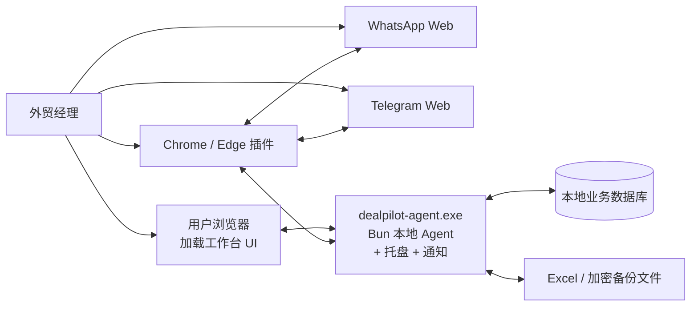
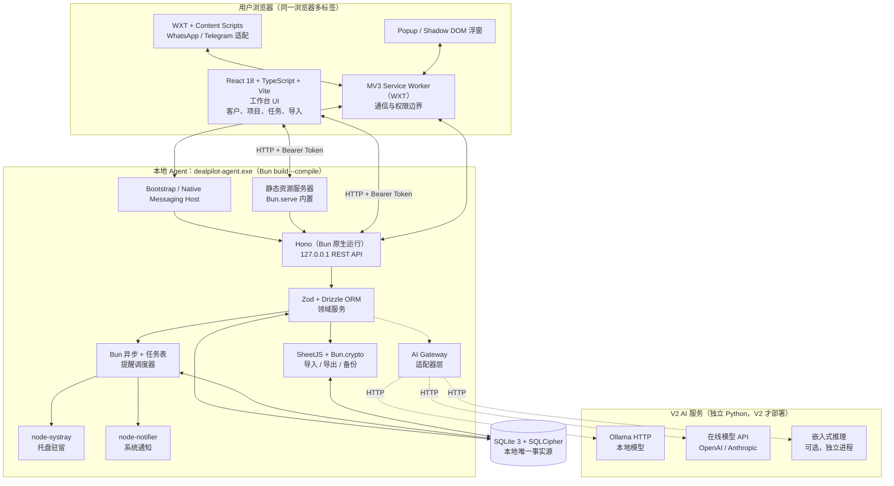
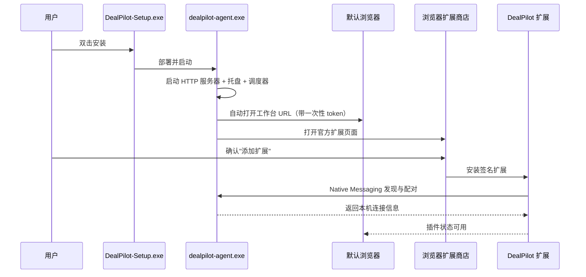
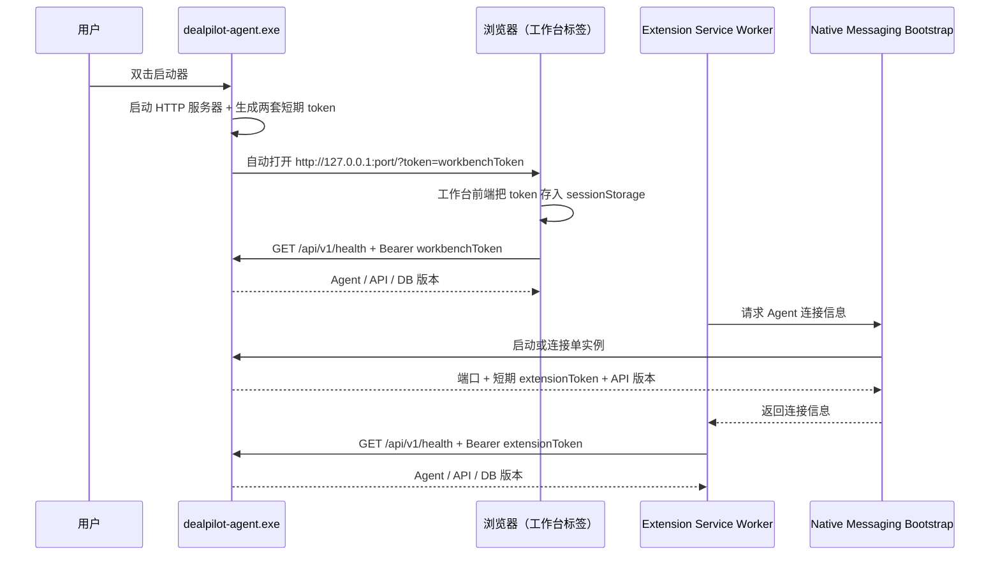
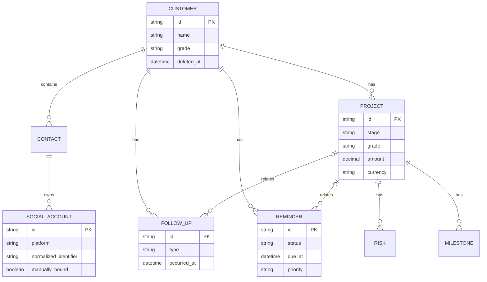
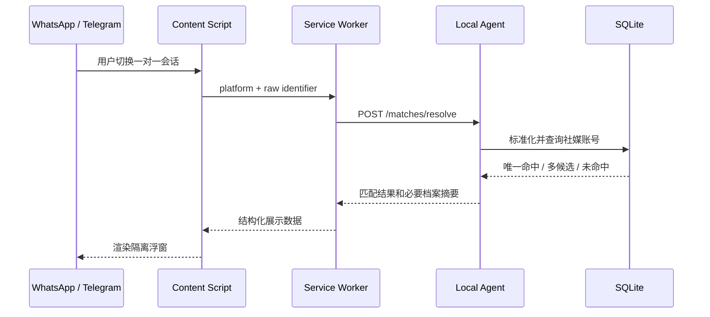
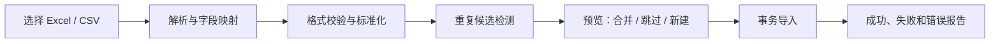
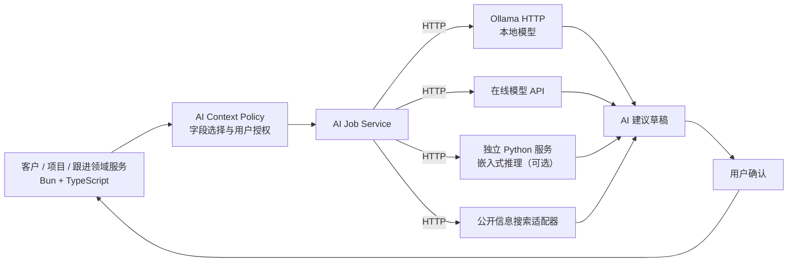

# DealPilot 系统架构设计 V1.3（历史文件）

> 本文件保留 V1.3 本地桌面方案作为历史迁移参考，不再作为当前产品交付或验收依据。
> 当前有效架构以 [DealPilot 系统架构设计 V2.1](./DealPilot_系统架构设计_V2.1_WebCloud.md) 为准，产品需求以 [DealPilot PRD V2.1](./DealPilot_PRD_V2.1_WebCloud.md) 为准。
>
> **重要：本文件是历史文件。** 当前实施只按 [DealPilot 系统架构设计 V2.1](./DealPilot_系统架构设计_V2.1_WebCloud.md) 执行。下方 V1.2/V1.1/V1.0 章节中的 Agent 业务 API、SQLite 运行时主库、托盘、Windows 通知、开机自启、Native Messaging、EXE 和 NSIS 均已废弃；仅可用于理解旧行为或读取迁移源。

---

## 1. 文档概览

| 项目 | 内容 |
|------|------|
| 文档版本 | V2.1 |
| 状态 | Web/Cloud 当前架构基线 |
| 日期 | 2026-07-31 |
| 关联需求 | [DealPilot_PRD_V2.1_WebCloud.md](./DealPilot_PRD_V2.1_WebCloud.md) |
| 开发平台 | 本地 Supabase CLI/Docker PostgreSQL、Auth、Storage、Edge Functions |
| 核心约束 | Web/PWA 优先、PostgreSQL 唯一事实源、个人账号隔离、模块化单体 |
| 一期 AI | 不实现；V2 AI 走独立 Python 服务，经 HTTP 接入 AI Gateway |
| 交付形态 | Web/PWA 静态前端 + 云端 Supabase/PostgreSQL；不以 exe、托盘或安装器作为产品入口 |

### 1.1 当前修订（V2.1）

V2.1 将架构从“本地 Agent + SQLite 产品”切换为“云端模块化单体 + PostgreSQL 产品”。开发者本机运行 Supabase/PostgreSQL 是云端架构的本地实例，不是另一套后端。

当前决策：

1. Web/PWA 使用 Atomic CRM 派生前端，所有网络访问经过 `packages/api-client`。
2. Supabase Auth/OIDC、PostgreSQL RLS、RPC、Edge Functions 和 Storage 组成云端后端。
3. 业务模块保持 Controller/Service/Repository 三层和模块化单体边界。
4. SQLite/Agent 只提供一次性迁移输入、快照读取和本地取证工具，不参与产品业务读写。
5. 浏览器扩展在本地开发和云端发布都通过统一客户端访问对应 API；Native Messaging 不属于当前本地门槛。
6. V1.3 的 Bun Agent、SQLite、NSIS、托盘和系统通知内容全部降级为历史附录。

### 1.2 V1.2 修订回顾

V1.2 进一步简化前端形态：去掉 Tauri 桌面壳，工作台 UI 改为浏览器直接加载。Node Agent 同时承担业务后端、静态资源服务、系统托盘和通知四项职责，不再依赖任何原生桌面框架。

本次修订要点：

1. **去掉 Tauri 桌面壳**（新增 ADR-13）：原 Tauri 仅用于壳、托盘和通知，业务能力全部在 Node Agent；Tauri 壳带来的 WebView 集成、Rust 工具链、跨语言桥接在 V1 没有收益
2. **工作台 UI 改为浏览器加载**：React + Vite 构建为静态资源，由 Node Agent 通过 `http://127.0.0.1:port/` 提供；用户双击启动器后自动打开默认浏览器
3. **Node Agent 升为顶层进程**：直接负责托盘（`node-systray`）、系统通知（`node-notifier`）、Native Messaging Host、HTTP 服务器和业务 API
4. **浏览器跨进程访问的认证机制**：Node Agent 启动时生成短期 token，启动 URL 中携带一次性 token，浏览器存入 sessionStorage 后所有 API 请求带 Bearer；严格 Origin 校验只允许 `http://127.0.0.1:port`
5. **安装包进一步缩小**：不再需要 Tauri WebView 运行时；Node SEA 单 exe + 静态资源 + SQLCipher + Native Messaging manifest

> V1.1 历史版本归档保留。

### 1.2 V1.1 修订回顾

V1.1 修订架构隔离原则，纠正 V1.0 把"业务后端语言"与"V2 AI 服务语言"绑定的隐含假设。V1.0 中 §15.1 末尾"业务仍在 Python Agent，为未来 AI 留口子"与 §14 已设计的 AI Gateway 适配器模式存在内部矛盾——既然 AI 通过适配器接入，业务后端选什么语言就不应被 V2 AI 绑架。

V1.1 修订要点：

1. **业务后端语言与 AI 服务语言解耦**（新增 ADR-12）：业务后端选最适合 V1 实际能力的语言；V2 AI 真要用 Python 时，独立起服务通过 HTTP 调用，业务后端零返工
2. **本地后端改为 Node.js / TypeScript**：V1 不做 AI，Python 名义优势里只有"AI 生态"是独家，其余能力（Excel、调度、SQLAlchemy、Pydantic）Node 都有等价方案；TS 全栈可让类型、Schema、API Client 在桌面端、插件、后端三处直通；安装包体积从 80–150MB 降至 30–50MB，空闲内存从 ~100MB 降至 ~50MB
3. **SQLCipher 打包风险大幅降低**：`better-sqlite3` 的 Windows + SQLCipher 支持成熟稳定，无需 V1.0 §21 中 G1 Spike 的 PyInstaller 高风险验证
4. **V2 AI 路径明确**：本地模型走 Ollama HTTP；在线模型走 API；只有"嵌入式本地推理"才需要独立 Python 服务，且届时作为独立进程部署

> V1.0 历史版本归档保留。

## 2. 当前架构结论

V2.1 采用“Web/PWA + 浏览器扩展 + 云端模块化单体 + PostgreSQL”的架构：

- Web/PWA 由浏览器加载，访问云端或本地 Supabase 开发环境。
- Cloud API 通过 PostgREST、RPC、Edge Functions 和统一客户端提供业务能力。
- PostgreSQL 是客户、项目、跟进、提醒、审计和设置的唯一事实源。
- Chrome / Edge 扩展负责 WhatsApp / Telegram 页面集成、浮窗和 popup，并通过统一客户端访问 Cloud API。
- 本地 Supabase CLI/Docker 只用于开发、测试和合成数据验收；其 schema、RLS 和函数必须与生产兼容。
- SQLite/Agent 只读取旧 V1 数据并执行迁移，不提供运行时业务 API、托盘、系统通知或桌面启动。

本地开发实例与云端生产实例共享同一 PostgreSQL/Supabase 契约；“本地”只表示部署位置，不改变后端边界。

## 3. 目标与非目标

### 3.1 架构目标

1. Web、PWA 和扩展通过同一类型化客户端访问云端业务事实源
2. 本地 Supabase/PostgreSQL 开发实例与云端生产实例保持 schema、RLS 和函数行为等价
3. 账号、权限、RLS、审计、备份和删除流程在服务端完成
4. 支持 Excel 导入、全量导出、云端备份、恢复和 SQLite 一次性迁移
5. 模块边界能够承接后续移动端和团队协作，但首版仍是个人账号
6. 业务逻辑可通过应用服务和内存适配器测试，不依赖具体部署环境

### 3.2 非目标

- 不实现多人协作、组织权限和审计后台
- 不实现团队协作和 workspace 权限
- 不在本地和云端之间长期双写
- 不自动发送 WhatsApp / Telegram 消息
- V1 不接入 LLM、向量数据库或网页背调服务
- V1 不支持 macOS 和 Linux；相关能力通过平台适配层预留

### 3.3 规模假设

| 维度 | V1 设计基线 |
|------|------------|
| 客户 | 10,000 条以内，验收基线 1,000 条 |
| 联系人/社媒账号 | 30,000 条以内 |
| 跟进记录 | 100,000 条以内，验收基线 10,000 条 |
| 项目 | 10,000 条以内 |
| 单次 Excel 导入 | 5,000 行以内，验收基线 1,000 行 |
| 并发用户 | 本地开发环境按测试账号；云端按发布容量配置 |
| 写并发 | PostgreSQL 事务、唯一约束和 RPC 原子性 |

---

## 4. 架构原则与关键决策

| 编号 | 决策 | 理由 |
|------|------|------|
| ADR-01 | 云端模块化单体是业务后端 | Web、PWA、扩展和未来移动端共享同一业务边界 |
| ADR-02 | PostgreSQL 是唯一业务事实源 | 账号隔离、事务、跨设备访问和备份恢复需要服务端单一事实源 |
| ADR-03 | 插件不保存完整业务数据 | 避免 IndexedDB 与后端数据库形成双写和同步问题 |
| ADR-04 | 工作台 UI 由浏览器加载 | Web/PWA 可部署到本地开发环境或云端，不需要原生桌面壳 |
| ADR-05 | API 客户端是唯一网络边界 | 统一认证、请求取消、响应解析和错误归一化 |
| ADR-06 | 云端授权由 Auth + RLS 完成 | 防止不同账号访问彼此业务数据 |
| ADR-07 | 提醒状态落库 | Web/PWA 和扩展可以从同一事实源恢复状态 |
| ADR-08 | AI 通过适配器接入 | 核心业务不依赖具体模型、向量库或供应商；AI 作为独立 Python 服务经 HTTP 调用 |
| ADR-09 | 指标按隐私策略采集 | 只记录必要的聚合指标，禁止消息正文和无关客户字段 |
| ADR-10 | 本地 Supabase 等价云端 | PostgreSQL、Auth、Storage、Edge Functions 在本地运行用于开发验证 |
| ADR-11 | 扩展独立于 Web 发布 | 本地开发可显式配置 API；商店和平台配对另设发布门 |
| ADR-12 | 业务后端语言与 AI 服务语言解耦 | V1 业务后端选最适合 V1 实际能力的语言；V2 AI 真要 Python 时作为独立服务部署，业务后端零返工 |
| ADR-13 | 不使用原生桌面壳（Tauri / Electron） | 产品入口是 Web/PWA；桌面安装、托盘和系统通知不属于当前范围 |

---

## 5. 系统上下文



边界说明：

- WhatsApp / Telegram 是外部宿主页面，插件只读取 PRD 允许的当前会话身份和用户主动标记的单条消息
- 用户浏览器加载 `http://127.0.0.1:port/` 打开工作台 UI；关闭浏览器标签后 Agent 仍驻留系统托盘继续提供提醒
- 本地 Agent、数据库和备份均运行或保存在用户设备
- V1 没有 DealPilot 云端业务服务

---

## 6. 逻辑架构



### 6.1 浏览器插件组件（WXT + React）

| 组件 | 职责 | 不负责 |
|------|------|--------|
| Content Script | 识别当前平台和会话；展示浮窗；接收用户标记动作 | 不持有 API 密钥；不直接访问数据库 |
| Service Worker | 调用本地 Agent；校验消息来源；管理平台标签页和角标 | 不保存业务事实数据 |
| Popup | 展示前 5 条待办、逾期和高风险提示 | 不自行计算业务优先级 |
| 平台适配器 | 隔离 WhatsApp / Telegram DOM 差异 | 不把平台选择器扩散到业务模块 |

Content Script 只能向 Service Worker 发送结构化命令。访问本地 Agent 的令牌仅存在于 Service Worker 运行上下文，不暴露给宿主页面。

### 6.2 Web 工作台组件

| 组件 | 职责 | 不负责 |
|------|------|--------|
| React 工作台 | 客户、项目、跟进、提醒、导入、备份和设置 UI | 不直接访问数据库；不持有长期密钥 |
| API Client | 会话令牌（sessionStorage）、版本检查、请求重试和统一错误展示 | 不缓存业务事实数据 |
| Tray Controller（Agent 内） | 通过 `node-systray`（Bun 兼容）在 Agent 进程内提供托盘菜单：打开工作台、查看提醒状态、退出 | 不改变业务对象状态 |
| Installer Bridge（Agent 内） | 检测插件、打开官方商店页、展示配对结果 | 不绕过浏览器安装确认 |

工作台 UI 是浏览器加载的静态资源，与浏览器插件共享类型、API Client 和表单 Schema，但不共享运行时状态。Token 仅保存在 sessionStorage，关闭标签即丢失，下次启动需要重新认证。

### 6.3 本地 Agent 组件

| 组件 | 职责 |
|------|------|
| Bootstrap | 单实例检查、启动 Agent、向指定扩展提供端口和短期访问令牌 |
| Local API | 请求校验、版本协商、错误封装、领域服务入口 |
| 客户服务 | 客户、联系人、社媒账号、合并和软删除 |
| 身份匹配服务 | 标准化账号标识、候选匹配、人工绑定与解绑 |
| 跟进服务 | 跟进时间线、消息标记、编辑和删除 |
| 提醒服务 | 提醒状态、优先级、稍后处理和去重 |
| 项目服务 | 项目、阶段、分级、风险和里程碑 |
| 导入服务 | Excel/CSV 解析、预览、去重候选和事务导入 |
| 备份服务 | 一致性快照、加密备份、校验和恢复 |
| 调度器 | 扫描到期提醒、里程碑和风险升级规则 |
| 系统通知适配器 | Windows 通知；未来可增加 macOS 适配器 |
| AI Gateway | V2 的模型、搜索和数据出境策略接口；V1 不加载实现 |

---

## 7. 进程与部署架构

### 7.1 运行单元

| 运行单元 | 进程位置 | 生命周期 |
|---------|---------|---------|
| DealPilot Agent | `dealpilot-agent.exe`（Bun `build --compile` 单文件） | 用户双击启动器或登录自启；驻留系统托盘直到用户从托盘退出 |
| Web 工作台 UI | 用户浏览器加载 `http://127.0.0.1:port/` | 浏览器标签生命周期；关闭标签不影响 Agent |
| Chrome 插件 | Chrome / Edge | 随浏览器加载 |
| Native Messaging Bootstrap | 浏览器按需启动 | 完成 Agent 发现后退出 |
| SQLite 数据库 | 用户本机文件 | 由 Agent 独占管理写入 |

Agent 以当前用户权限运行，不安装需要管理员权限的 Windows Service。安装包内部包含 Bun 编译的单文件（内嵌前端静态资源）、SQLCipher native 库（如需要）和 Native Messaging manifest；用户只感知一个安装入口和一个启动入口。

### 7.2 本地目录

```text
%LOCALAPPDATA%\DealPilot\
  app\dealpilot-agent.exe   # Bun build --compile 单文件（含业务代码 + 前端静态资源）
  app\web\                  # 工作台静态资源（HTML/JS/CSS）
  app\sqlcipher.dll         # SQLCipher native 库
  data\dealpilot.db         # 本地数据库
  config\                   # 端口、版本和受保护密钥
  logs\                     # 本地滚动日志，不记录客户正文
  recovery\                 # 升级前临时恢复点
```

用户主动导出的 Excel 和备份文件由用户选择保存位置，不固定放入上述目录。

### 7.3 安装与启动

安装程序输出为一个签名的 `DealPilot-Setup.exe`：

1. 用户双击安装包并选择安装目录
2. 安装程序部署 `dealpilot-agent.exe`（Bun 编译，内嵌前端静态资源）、SQLCipher native 库（如需要）、Native Messaging Manifest 和卸载器
3. 安装程序注册 Native Messaging Host（写入注册表指向 `dealpilot-agent.exe`）
4. 安装程序创建桌面快捷方式（指向 `dealpilot-agent.exe`）和开始菜单入口，可选启用"登录后后台提醒"
5. 安装完成后自动启动 `dealpilot-agent.exe`
6. Agent 完成健康检查、数据库初始化、版本协商和托盘驻留
7. Agent 自动打开默认浏览器到 `http://127.0.0.1:{port}/?token={oneTimeToken}`，并展示浏览器插件安装入口
8. 用户在 Chrome Web Store / Edge Add-ons 页面确认"添加扩展"
9. 扩展通过 Native Messaging 自动发现 Agent 并完成配对

Agent 不可用时，插件展示"本地服务未运行"，不得创建第二份浏览器本地业务数据作为临时替代。

### 7.4 一键启动

用户双击桌面快捷方式（指向 `dealpilot-agent.exe`）后：

1. Agent 进程单实例锁判断是否已运行；已运行则激活托盘菜单的"打开工作台"项，并重新打开浏览器
2. Agent 启动 HTTP 服务器监听 `127.0.0.1:{port}`，加载 SQLCipher 数据库，启动提醒调度器
3. Agent 启动系统托盘（`node-systray`），托盘菜单包含：打开工作台、查看提醒数、退出
4. Agent 生成一次性短期 token，调用系统默认浏览器打开 `http://127.0.0.1:{port}/?token={oneTimeToken}`
5. 浏览器加载工作台 UI，前端从 URL 提取 token 存入 sessionStorage，后续 API 请求带 `Authorization: Bearer {token}`
6. 浏览器插件已安装时同步显示连接状态；未安装时工作台首页提供安装入口

关闭浏览器标签默认不退出 Agent，托盘继续运行以保持提醒能力。用户从托盘选择"彻底退出"时必须提示退出后不再实时提醒。

### 7.5 浏览器插件安装边界

普通个人版遵守 Chrome / Edge 安全机制：

- 安装程序可以检测浏览器、打开对应官方扩展商店页面，并在安装后自动配对
- 浏览器必须由用户点击一次"添加扩展"并确认权限，EXE 不能静默绕过
- 不使用开发者模式加载未打包扩展，不修改浏览器安全策略

企业受管设备可提供单独部署文档，通过 `ExtensionInstallForcelist` 策略静默安装；该模式需要管理员权限和组织策略，不属于个人版默认流程。



---

## 8. 本地通信与认证

### 8.1 通信方式

- Agent 进程自启：双击 `dealpilot-agent.exe` 后，进程内部启动 HTTP 服务器（`Bun.serve`）、托盘、调度器和 Native Messaging Host
- 浏览器工作台：用户浏览器加载 `http://127.0.0.1:{port}/?token={oneTimeToken}`，工作台前端把 token 存入 sessionStorage
- 浏览器插件 Bootstrap：Chrome Native Messaging 直接调用 `dealpilot-agent.exe`
- 业务 API：`http://127.0.0.1:{port}/api/v1/*`
- Agent 只监听 `127.0.0.1`，禁止监听 `0.0.0.0` 和局域网地址
- Content Script 不直接访问本地 API，所有请求经过 Service Worker
- 工作台前端调用业务 API 时必须带 Bearer Token（来自 sessionStorage）

### 8.2 无登录认证

"无需登录"不等于本地 API 无保护。Agent 启动时生成两套独立短期令牌：一套用于浏览器工作台（一次性 URL token + sessionStorage Bearer），一套用于浏览器插件（Native Messaging Bootstrap 颁发）。



安全规则：

- Native Messaging Manifest 只允许正式扩展 ID
- 工作台和插件使用独立的短期访问令牌，互不通用
- 工作台 token 通过 URL 一次性传入，浏览器存入 sessionStorage（不写入 localStorage），关闭标签即失效
- 严格 Origin 校验：工作台 API 请求只允许 `Origin: http://127.0.0.1:{port}`，插件 API 请求只允许扩展 Origin
- API 访问令牌不得放入 URL、日志或 Content Script
- Agent 重启后旧令牌全部失效，工作台重新加载、扩展重新执行 Bootstrap
- 单实例锁防止多个 Agent 同时写数据库
- 工作台前端代码由 Agent 静态资源服务器提供（同源），不存在跨域资源加载

---

## 9. 数据架构

### 9.1 核心实体

| 实体 | 关键内容 |
|------|---------|
| Customer | 公司、国家、来源、客户分级、状态 |
| Contact | 姓名、职位、邮箱、电话 |
| SocialAccount | 平台、账号标识、标准化标识、人工绑定状态 |
| Project | 金额、币种、概率、阶段、项目分级、预计成交日 |
| FollowUp | 类型、备注、消息正文、发生时间、关联客户/项目 |
| Reminder | 类型、到期时间、状态、优先级、处理结果 |
| Risk | 严重度、状态、处理日期、关联项目 |
| Milestone | 名称、日期、完成状态、关联项目 |
| ImportJob | 文件摘要、字段映射、成功/失败统计 |
| LocalEvent | 本地操作事件，用于指标和问题排查，不远程上报 |

### 9.2 关系模型



### 9.3 SQLite 约束

- 启用外键约束、WAL 模式和 `busy_timeout`
- Agent 是唯一写入者，所有跨实体操作使用事务
- 主键使用客户端生成的 UUID，支持幂等重试
- 时间统一以 UTC 存储，界面按本机时区展示
- 手机号按 E.164 标准化；邮箱忽略大小写；平台账号保存原值和标准化值
- 软删除对象保留 `deleted_at`，30 天后由本地清理任务永久删除
- 数据库 Schema 使用单调递增版本，升级前自动创建恢复点

### 9.4 本地加密

推荐生产版本使用 SQLite + SQLCipher：

- 首次启动生成随机数据库密钥
- 数据库密钥使用 Windows DPAPI 按当前用户保护
- 数据库文件和配置目录设置仅当前用户可访问的 ACL
- 该方案防止数据库文件被直接复制后读取，但不能防御已经控制当前 Windows 用户会话的攻击者

SQLCipher 的 Windows 打包、升级和恢复必须在架构 Spike 中验证。不得在验证失败时静默降级为明文数据库。

---

## 10. API 设计

### 10.1 API 分组

| 路径 | 领域 |
|------|------|
| `/api/v1/health` | Agent、API 和数据库版本 |
| `/api/v1/customers` | 客户、联系人、社媒账号和合并 |
| `/api/v1/matches` | 会话身份匹配、绑定和解绑 |
| `/api/v1/follow-ups` | 跟进记录 |
| `/api/v1/reminders` | 提醒、完成、稍后和忽略 |
| `/api/v1/projects` | 项目、风险和里程碑 |
| `/api/v1/imports` | 文件预览、冲突处理和导入 |
| `/api/v1/exports` | Excel 和统计报告导出 |
| `/api/v1/backups` | 备份、校验和恢复 |
| `/api/v1/settings` | 本地设置和备份提醒 |

### 10.2 API 约定

- 路由按 `/api/v1` 版本化，扩展与 Agent 进行兼容范围检查
- 写请求支持 `Idempotency-Key`，重复请求返回首次结果
- 错误响应统一包含 `code`、`message`、`details` 和 `request_id`
- 列表使用游标分页，避免跟进时间线随数据增长一次性加载
- 文件导入分为“解析预览”和“确认提交”两个阶段
- 恢复操作具有全局互斥锁，恢复期间拒绝其他写请求

---

## 11. 关键业务流程

### 11.1 会话识别与浮窗展示



平台 DOM 解析只存在于平台适配器。后端不接触页面 DOM，只接收结构化身份标识和用户主动标记的消息。

### 11.2 标记跟进记录

1. 用户点击某条消息旁的“标记”
2. Content Script 读取该条消息正文、方向、时间和当前会话身份
3. Service Worker 生成幂等键并调用跟进 API
4. Agent 在一个事务中校验客户绑定并写入跟进记录
5. 返回成功后刷新浮窗时间线；失败时保留编辑内容供用户重试

### 11.3 提醒调度

提醒不能只依赖 Chrome 定时器。Agent 使用数据库中的提醒表作为事实源：

1. Agent 启动和系统从休眠恢复时扫描所有已到期未处理提醒
2. 运行期间按固定短周期查询下一批到期提醒
3. 使用“提醒 ID + 当前状态 + 通知日期”生成通知去重键
4. Agent 发送 Windows 系统通知并更新 `last_notified_at`
5. 浏览器运行时，插件从 Agent 获取待办数量并更新角标
6. 用户完成、稍后或忽略后，Agent 原子更新提醒状态

连续逾期和风险升级仅改变排序权重，不自动改变业务状态，遵守 PRD V1.5 的手动流转原则。

### 11.4 Excel 导入



导入阶段不得边解析边覆盖正式数据。用户确认前只保存临时预览；正式提交必须在事务中执行。

### 11.5 备份与恢复

- Agent 使用 SQLite Backup API 创建一致性快照
- 备份包含数据库快照、Schema 版本、应用版本和完整性摘要
- 用户设置备份密码；使用 Argon2id 派生密钥，AES-256-GCM 加密归档
- 恢复时先解密到临时目录，执行完整性和版本校验，再切换正式数据库
- 密码错误、文件损坏或迁移失败时不得覆盖当前数据库
- 应用升级前自动创建仅用于回滚的本机恢复点

---

## 12. 故障处理与恢复

| 故障 | 系统行为 |
|------|---------|
| Agent 未启动 | Bootstrap 尝试启动；失败时插件展示修复入口，不创建临时数据副本 |
| 数据库被锁 | 有限次数退避重试；超时后保留用户输入并提示 |
| 磁盘空间不足 | 停止写入，不删除现有数据；引导清理空间或导出备份 |
| 数据库完整性检查失败 | 进入只读保护模式，允许导出支持包和选择恢复点 |
| 数据迁移失败 | 回滚到升级前恢复点，Agent 保持旧 Schema 可读 |
| 平台 DOM 变化 | 关闭受影响的平台适配器；本地工作台继续可用 |
| 系统休眠错过提醒 | 恢复后扫描并补发，标记为逾期 |
| 扩展与 Agent 版本不兼容 | 阻止写入，提示升级对应组件 |

原则：任何无法确认写入安全的故障都应停止写入，不能用空对象、默认值或新数据库覆盖原数据。

---

## 13. 安全与隐私

### 13.1 信任边界

| 边界 | 可信度 | 处理原则 |
|------|-------|---------|
| 本地 Agent 与数据库 | 受当前 Windows 用户保护 | 可处理完整业务数据 |
| 浏览器工作台标签 | 同源加载、Origin 校验 | 可访问完整工作台数据，令牌仅存 sessionStorage |
| Extension Service Worker | 受扩展权限保护 | 可持有短期 API 令牌 |
| Content Script | 运行在外部页面附近 | 只接收必要展示数据，不持有令牌 |
| WhatsApp / Telegram 页面 | 外部、不可信 | 不写入业务数据和认证信息 |
| 同浏览器其它标签 | 不可信 | 严格 Origin 校验，拒绝非工作台 Origin 的请求 |
| 导出文件 | 离开应用控制 | 明文 Excel 警告；备份必须加密 |
| 未来在线 AI 服务 | 外部、不可信 | 默认禁止发送，用户授权后最小化出境 |

### 13.2 主要威胁与控制

| 威胁 | 控制 |
|------|------|
| 恶意网页访问本地 API | 回环绑定、严格 Origin/Host 校验、Bearer Token |
| 同浏览器其它标签访问 API | Origin 白名单只允许 `http://127.0.0.1:{port}`，工作台 token 不写入 localStorage |
| 伪造本地进程调用 API | 进程启动握手、独立短期令牌和代码签名 |
| 宿主页面窃取令牌 | Content Script 不持有令牌，通信经过 Service Worker |
| 局域网访问 | 禁止绑定非回环地址，安装防火墙规则验证 |
| 数据库文件被复制 | SQLCipher、DPAPI 密钥保护、用户目录 ACL |
| 备份文件泄露 | 用户密码 + Argon2id + AES-256-GCM |
| 日志泄露客户信息 | 日志字段白名单，不记录消息正文、邮箱和完整手机号 |
| 安装包被篡改 | Windows 代码签名、扩展商店签名、更新包校验 |
| 本地 API 被重放 | 短期令牌、幂等键和敏感操作确认 |

### 13.3 数据出境规则

V1 不发送业务数据、消息正文和使用事件。版本检查也不得携带客户统计。

未来 AI 上线后，必须区分：

- 本地 AI：模型和推理均在本机，无业务数据出境
- 在线 AI：用户在每次任务或明确授权范围内确认，系统展示将发送的字段，只发送最小必要上下文
- 海外客户背调：公司名和公开网址可能发送给搜索服务；结果必须记录来源和采集时间

---

## 14. AI 扩展架构

V1 不部署 AI 依赖，但领域数据和模块接口应允许 V2 叠加，不能让 AI 直接写核心业务表。

**关键架构原则（ADR-12）**：V2 AI 走独立 Python 服务，通过 HTTP 接入业务后端的 AI Gateway。业务后端（Bun + TypeScript）和 AI 服务（Python）进程隔离、互不影响。这样：

- V1 业务后端语言不被 V2 AI 绑架
- V2 AI 服务可独立迭代、独立部署、独立升级
- 本地推理、在线 API、嵌入式推理三种模式可同时支持

### 14.0 AI 接入模式

| 模式 | 部署形态 | 语言 | 何时使用 |
|------|---------|------|---------|
| 本地模型 HTTP | Ollama / LM Studio 独立服务 | Go / 任意 | 默认推荐，本机隐私 |
| 在线模型 API | OpenAI / Anthropic / Google | 任意图灵完备语言 | 用户授权后调用 |
| 嵌入式本地推理 | 独立 Python 进程 | Python + transformers / llama-cpp-python | 需要 GPU 直推或特殊模型时 |
| 公开信息检索 | 独立 Python 或直接 fetch | 任意 | 公司背调 |

业务后端只通过 HTTP 调用上述服务，不嵌入 Python 运行时。



### 14.1 扩展接口

| 接口 | 作用 |
|------|------|
| `AIProvider` | 屏蔽本地模型和在线模型差异；底层是 HTTP 客户端 |
| `ResearchProvider` | 搜索公开公司信息并返回来源 |
| `ContextPolicy` | 决定哪些字段允许进入某次 AI 请求 |
| `AIJobService` | 管理长任务、取消、重试和结果状态 |
| `SuggestionRepository` | 保存 AI 草稿、来源和用户采纳结果 |

所有接口在业务后端（Bun + TypeScript）实现，调用 AI 服务时统一走 HTTP。V2 部署独立 Python 服务时，业务后端无任何改动。

### 14.2 AI 数据原则

- AI 只生成建议，不自动发送消息，不自动改变客户或项目状态
- AI 建议与人工数据分开存储，用户确认后才能写入业务字段
- 每条背调结论保留来源 URL、抓取时间和原文摘要
- 本地检索优先使用 SQLite FTS5；需要向量检索时评估 `sqlite-vec`，不引入云端 `pgvector`
- 在线模型密钥由本地 Agent 管理，不暴露给插件页面
- AI 服务即使部署在本机，也只通过 HTTP 与业务后端通信，不直接读业务数据库

---

## 15. 技术栈

### 15.1 Web 工作台前端

| 类别 | 选型 | 用途 |
|------|------|------|
| 宿主 | 用户浏览器（Chrome / Edge 最新两版） | 加载工作台 UI 静态资源 |
| UI 框架 | React 18 + TypeScript 5 | 工作台界面 |
| 构建工具 | Vite | 构建静态资源，由 Agent `Bun.serve` 托管；与插件 WXT 共享 Vite 构建心智模型 |
| 路由 | TanStack Router | 工作台路由和类型约束 |
| 服务端状态 | TanStack Query | API 缓存、失效和错误状态，不作为业务事实源 |
| 本地 UI 状态 | Zustand | 窗口、筛选和临时交互状态 |
| 表单 | React Hook Form + Zod | 客户、项目、提醒和导入映射表单 |
| 样式与组件 | Tailwind CSS + Radix UI + Lucide React | 可访问基础组件和统一图标 |
| 表格 | TanStack Table | 客户、项目和导入预览列表 |
| 图表 | Apache ECharts | V1.5 销售漏斗和复盘看板；V1 不强依赖 |
| 前端测试 | Vitest + Testing Library + Playwright | 组件、工作台和端到端测试 |

不使用原生桌面壳（Tauri / Electron）的核心理由：

1. **V1 业务能力全部在 Bun Agent**，原生壳仅承担 WebView、托盘和通知三项辅助能力
2. **浏览器加载 UI** 完全替代 WebView，并由 Agent `Bun.serve()` 直接托管静态资源
3. **`node-systray` + `node-notifier`** 替代原生壳的托盘和通知能力，Bun 兼容 Node 库
4. **避免 Rust 工具链、Tauri 跨语言桥接和 WebView 运行时**，构建链更简单
5. **安装包体积更小**：Bun `build --compile` 单文件（内嵌前端+后端）+ SQLCipher，预估 25–40MB

### 15.2 浏览器插件前端

| 类别 | 选型 | 用途 |
|------|------|------|
| 插件框架 | WXT | Vite-native、Manifest V3、Content Script、popup 和 Service Worker；跨浏览器构建（Chrome/Edge/Firefox） |
| 构建工具 | Vite（WXT 内置） | 与工作台前端共享 Vite 构建心智模型和 HMR 体验 |
| UI | React 18 + TypeScript 5 | 浮窗和 popup |
| 样式 | Tailwind CSS + Radix UI + Lucide React | 与工作台共享设计语言 |
| 页面隔离 | Shadow DOM | 防止宿主页样式污染浮窗 |
| 状态 | TanStack Query + 轻量 Zustand | Agent 数据请求和临时 UI 状态 |
| 自动导入 | WXT auto-imports | `browser`、`storage` 等 API 自动注入，减少样板代码 |
| 测试 | Vitest + Playwright | 平台适配器和浏览器端到端测试 |

选择 WXT 而非 Plasmo 的理由：

1. **统一 Vite 工具链**：前端 Vite + 插件 WXT（Vite-native），构建配置、HMR、dev server 体验一致；Plasmo 依赖 Parcel，已落后于 Vite 生态
2. **维护更活跃**：2025 多个评测指出 WXT 是浏览器插件框架的市场领导者，Plasmo 处于维护放缓状态
3. **框架无关**：WXT 对 React、Vue、Svelte 都是等支持，未来切换 UI 框架成本低
4. **跨浏览器构建**：`wxt zip` 一次配置，自动生成 Chrome、Edge、Firefox 的不同 manifest 和打包文件
5. **自动导入**：`browser`、`storage` 等 API 自动注入，减少 `import` 样板代码

工作台和插件共享 TypeScript 类型、API Client、表单 Schema、日期/金额格式化和基础 UI Token，但不共享运行时状态。

### 15.3 本地后端

| 类别 | 选型 | 用途 |
|------|------|------|
| 语言 / 运行时 | Bun 1.3+ + TypeScript 5 | 本地业务、Excel 处理、提醒调度、托盘、通知 |
| 进程形态 | `bun build --compile` 单文件 | 打包成 `dealpilot-agent.exe`，内嵌前端静态资源，无需用户预装 Bun |
| HTTP 服务器 | Hono（Bun 原生运行） | 业务 REST API + 工作台静态资源托管（`Bun.serve` 内置） |
| 数据校验 | Zod | API、配置和导入数据校验；与前端共享 Schema |
| ORM / 迁移 | Drizzle ORM + drizzle-kit | 仓储、事务和 Schema 升级 |
| 数据库 | `bun:sqlite` 或 `better-sqlite3` + SQLCipher | 本地唯一事实源和文件加密；G1 Spike 验证 `bun:sqlite` 是否支持 SQLCipher，不行则回退 `better-sqlite3`（Bun 兼容） |
| Excel / CSV | SheetJS（xlsx）+ PapaParse | 解析、预览、错误报告和导出 |
| 密码派生 / 加密 | `Bun.password.hash`（Argon2id）+ `node:crypto`（AES-256-GCM） | 备份密码派生和加密归档；Bun 内置 Argon2id，不需要 `@node-rs/argon2` |
| 后台任务 | Bun 异步循环 + 数据库任务表 | 提醒、清理和备份调度 |
| 系统托盘 | node-systray | 进程驻留、菜单项、关闭浏览器后保持提醒；需验证 Bun 兼容性 |
| Windows 通知 | node-notifier | Toast 通知；需验证 Bun 兼容性 |
| 浏览器自启 | 默认浏览器协议（`start` / `xdg-open`） | Agent 启动后自动打开工作台 URL |
| 本机认证 | Native Messaging Host + 短期 Bearer Token | 插件发现和 API 保护 |
| 后端测试 | `bun:test` + supertest | 领域、数据库和 API 测试 |

后端选 Bun + TypeScript 而非 Python 或 Node.js 的核心理由：

1. **类型全栈直通**：Zod Schema 同时用于后端校验和前端表单，Pydantic 在双语言下做不到
2. **V1 不做 AI**：Python 名义上的独家优势（LangChain、transformers）V1 完全用不到；V2 AI 走独立服务后，业务后端语言不再受 AI 生态约束
3. **打包成熟度**：`bun build --compile` 支持全栈打包（前端 HTML/React + 后端 API + 依赖进单文件），比 Node SEA（Node 25.5+ 才简化、ESM 下不支持 V8 代码缓存）更成熟
4. **SQLite 原生支持**：`bun:sqlite` 零编译、性能优于 `better-sqlite3`；SQLCipher 支持需 G1 Spike 验证，不行则回退 `better-sqlite3`（Bun npm 兼容层可运行）
5. **内置加密**：`Bun.password.hash` 内置 Argon2id，`Bun.crypto` 提供 WebCrypto API，不需要额外 `@node-rs/argon2` 依赖
6. **启动更快**：Bun `--compile` 产出的 exe 启动时间优于 Node SEA（尤雨溪实测 Node SEA + Rolldown 略胜，但 Bun 1.3.9 字节码优化后反超约 25%）
7. **安装包体积和驻留内存**：Bun 全栈打包 25–40MB、空闲 30–50MB；Node SEA 30–50MB、空闲 40–70MB；PyInstaller 80–150MB、空闲 80–120MB

### 15.4 工程与打包

| 类别 | 选型 | 用途 |
|------|------|------|
| Monorepo | pnpm workspaces + Turborepo | 工作台（Vite）、插件（WXT）、后端（Bun）和共享类型包；统一 Vite 构建链 |
| Agent 打包 | Bun `build --compile` | 生成 `dealpilot-agent.exe` 单文件，内嵌前端+后端+依赖，体积 25–40MB |
| 静态资源 | `bun build --production` 构建前端 → 内嵌于 Agent 单文件 | 工作台 UI；`Bun.serve()` 直接托管，不再需要独立静态资源目录 |
| 安装包 | NSIS（或 Inno Setup） | 输出单个 `DealPilot-Setup.exe`，包含 Agent + 静态资源 + sqlcipher.dll + Native Messaging manifest |
| 安装签名 | Windows Authenticode | 降低 SmartScreen 警告并验证发布者 |
| 扩展发布 | Chrome Web Store + Edge Add-ons | 浏览器签名、更新和用户确认安装 |
| CI | GitHub Actions Windows Runner | 构建、测试、签名和生成发布物 |

用户看到的是一个安装 EXE 和一个启动 EXE（`dealpilot-agent.exe`）；SQLCipher native 库和 Native Messaging manifest 由安装程序管理，不要求用户安装 Python、Bun 或 Rust。

选型不是 PRD 验收内容。Bun `build --compile` 打包、SQLCipher 兼容性、Native Messaging、node-systray 托盘、node-notifier 通知和商店扩展配对必须先通过架构 Spike，未验证前不得承诺完整排期。

---

## 16. 可观测性与支持

本地优先不意味着没有诊断能力：

- `/api/v1/health` 返回 Agent、API、数据库 Schema 和适配器版本
- 日志在本地滚动保存，默认保留 14 天，单文件和总空间均设上限
- 日志不记录客户名称、邮箱、手机号、消息正文和备份密码
- 用户主动点击后可导出“支持包”，包含版本、脱敏错误、数据库完整性结果和最近故障
- 支持包在导出前展示内容清单，不自动上传
- 产品指标在本机聚合，用户主动导出不含身份信息的统计报告

---

## 17. 性能与可靠性目标

| 指标 | 目标 |
|------|------|
| 浮窗档案展示 | 本地 Agent 已运行时 P95 <= 1 秒 |
| API 普通读请求 | 1,000 客户基线下 P95 <= 300 ms |
| Excel 导入 | 1,000 行 P95 <= 30 秒 |
| 提醒触达 | Agent 正常运行时，到期后 5 分钟内 |
| 一键启动 | 双击 `dealpilot-agent.exe` 到工作台可操作 P95 <= 5 秒 |
| 后台资源 | 空闲时 Bun Agent 内存目标 <= 80 MB（目标 30–50MB），CPU 接近 0 |
| 数据一致性 | 事务失败不得产生半完成对象 |
| 恢复安全 | 失败恢复不得覆盖当前数据库 |
| 离线可用 | 除宿主社媒页面外，一期业务功能不依赖互联网 |

---

## 18. 测试策略

### 18.1 自动化测试

- 领域单元测试：分级排序、提醒状态、风险升级、去重和合并
- 数据集成测试：事务回滚、外键、软删除、迁移和并发写保护
- API 合约测试：版本、认证、幂等和错误码
- Bun Agent 测试：单实例锁、托盘菜单、HTTP 服务器启动、静态资源加载、浏览器自动打开、Bun `--compile` 打包后行为
- 插件测试：平台适配器、Service Worker 消息边界和权限
- 安装测试：全新安装、覆盖升级、卸载、Native Messaging 注册和商店配对
- 端到端测试：导入客户到会话识别、标记、提醒和完成
- 安全测试：非回环访问、非法 Origin、无令牌请求、同浏览器其它标签越权和令牌泄露扫描

### 18.2 必测恢复场景

1. Agent 在写入中被强制结束
2. 数据库迁移过程中断电
3. 磁盘空间耗尽
4. 备份密码错误、文件截断和版本过新
5. Chrome 扩展升级但 Agent 未升级，反向场景亦然
6. Windows 休眠跨过提醒到期时间
7. WhatsApp / Telegram DOM 选择器失效
8. 用户拒绝安装扩展、扩展被禁用或浏览器商店不可访问
9. 用户关闭浏览器标签后重新打开，工作台 token 是否需要重新生成
10. 多个浏览器标签同时打开工作台，sessionStorage token 是否冲突

---

## 19. 发布与升级

### 19.1 版本协商

Agent 健康检查返回：

- `agent_version`
- `api_version`
- `db_schema_version`
- `platform_adapter_version`

扩展内置可兼容的 API 版本范围。不兼容时只能进入只读诊断页，不得继续写数据。

### 19.2 升级顺序

1. Agent 下载并校验签名更新包
2. 创建升级前恢复点
3. 停止调度器并关闭数据库写入
4. 更新 `dealpilot-agent.exe` 单文件（Bun 编译，内含前端和后端）和 SQLCipher native 库（如需要），执行数据库迁移
5. 完整性检查通过后恢复 HTTP 服务器、托盘和调度器
6. 浏览器刷新工作台标签加载新静态资源；浏览器扩展由官方商店更新，并按兼容范围继续工作或提示升级

V1 可先采用用户确认更新，不做无提示强制升级。

---

## 20. 风险与权衡

| 风险/权衡 | 影响 | 应对 |
|-----------|------|------|
| Bun `build --compile` 全栈打包 | 前端和后端打进单文件，需验证 Bun 对 Windows 原生模块（node-systray 等）的编译支持 | G1 Spike S2 验证；如原生模块不兼容，回退 `@vercel/ncc` 预打包 + Bun `--compile` 仅封装 JS 层 |
| Node-systray / node-notifier Bun 兼容性 | Bun 的 npm 兼容层可能不完全支持 C++ 原生模块 | G1 Spike S7/S8 验证；如不兼容，改用 `bun:ffi` 直接调用 Windows API 或 `node-ffi-napi` |
| SQLCipher 在 Bun 上的支持 | `bun:sqlite` 是否支持 SQLCipher 扩展待验证；`better-sqlite3` 在 Bun 上通过 npm 兼容层可能可用 | G1 Spike S6 验证；`bun:sqlite` + SQLCipher 不可行则回退 `better-sqlite3`；`better-sqlite3` 也不行则改 DPAPI 加密数据库文件 |
| 安装包无法静默安装个人浏览器扩展 | 用户仍需在商店确认一次 | 安装后直达商店、步骤引导、安装完成自动配对 |
| Native Messaging 配置失败 | 插件无法发现 Agent | 安装校验、诊断页、重新注册工具 |
| SQLCipher Windows 打包风险 | 可能阻断加密数据库交付 | G1 Spike S6 验证 `bun:sqlite` + SQLCipher 或 `better-sqlite3` + SQLCipher 在 Bun 上的可行性；验证后不允许静默降级 |
| 本地唯一副本易受磁盘故障影响 | 用户可能永久丢失数据 | 首次导入和逾期备份提醒、加密备份、升级恢复点 |
| Node Agent 后台运行增加资源占用 | 用户可能彻底退出 | 托盘模式、空闲低功耗、资源上限、明确解释提醒依赖 |
| 浏览器标签关闭后用户以为程序退出 | 实际 Agent 仍驻留托盘，可能造成困惑 | 托盘图标状态提示、关闭标签时 Toast 提示"Agent 仍在后台运行" |
| 浏览器工作台 token 通过 URL 传入 | token 可能进入浏览器历史 | 启动 URL 使用一次性 token，前端读取后立即从 URL 中清除（history.replaceState） |
| 扩展和 Agent 独立升级 | 可能产生版本不兼容 | API 版本协商和兼容矩阵 |
| 平台 DOM 频繁变化 | 插件能力失效 | 平台适配层、回归样本和降级到人工绑定 |
| 在线 AI 与本地隐私承诺冲突 | 用户信任风险 | 本地/在线模式分离、请求前预览和明确授权 |
| V2 AI 服务需独立 Python 环境 | 用户安装 Python 解释器或独立打包 | 默认走 Ollama HTTP（无需 Python）；嵌入式推理时单独打 Python 安装包；不混入 V1 安装包 |

---

## 21. 实施阶段与架构门禁

| 阶段 | 目标 | 退出条件 |
|------|------|---------|
| G0 平台 Spike | 验证 WhatsApp / Telegram 页面能力 | 满足 PRD 第 4 章 |
| G1 本地架构 Spike | 验证 Bun `build --compile` 打包、Native Messaging、SQLCipher、node-systray 托盘、node-notifier 通知、自动开浏览器和备份恢复 | 七条链路均有可运行原型和失败结论 |
| G2 架构骨架 | 建立 EXE 安装启动、HTTP 服务器、静态资源、数据库、工作台和版本协商 | 可安装、启动、写入、升级、卸载和配对扩展 |
| V1 业务实现 | 客户、匹配、跟进、提醒、项目和导入 | 通过 PRD V1 上线验收 |
| V2 AI Spike | 验证本地模型与在线模型适配 | 单独 AI PRD 和隐私评审通过 |

G1 应优先验证：

1. `DealPilot-Setup.exe` 可在无 Python/Node/Bun/Rust 环境的全新 Windows 用户下完成安装和卸载
2. `dealpilot-agent.exe`（Bun `build --compile`）可启动、复用单实例锁、监听回环并自动打开默认浏览器到工作台 URL
3. Chrome / Edge 扩展通过 Native Messaging 发现并认证 Agent（Agent 直接作为 NM Host）
4. Agent 只监听回环地址，普通网页和同浏览器其它标签无法调用 API
5. SQLCipher 数据库在安装包内可创建、升级和恢复（优先验证 `bun:sqlite` + SQLCipher，回退 `better-sqlite3` + SQLCipher）
6. `node-systray` 在 Bun 运行时 + Windows 11 上稳定显示托盘菜单
7. `node-notifier` 在 Bun 运行时 + Chrome 关闭时仍能触达 Windows 系统通知
8. 加密备份在全新安装环境中可恢复（`Bun.password.hash` Argon2id + AES-256-GCM）
9. Bun `build --compile` 打包的 exe 启动时间和内存占用符合 §17 性能目标

---

## 22. 待决策事项

| 编号 | 决策 | 建议 |
|------|------|------|
| A-01 | 关闭浏览器标签后是否仍驻留托盘、随 Windows 登录自启 | 默认驻留托盘；首次启动询问是否开机自启；用户从托盘"彻底退出"才停止服务 |
| A-02 | 是否必须启用 SQLCipher | 是，前提是 G1 打包验证通过 |
| A-03 | V1 是否支持 Edge 商店独立发布 | 可共用 Chromium 包，发布流程单独处理 |
| A-04 | 是否购买 Windows 代码签名证书 | 是，降低安装警告和篡改风险 |
| A-05 | 备份密码遗忘是否提供找回 | 不提供；明确提示密码不可恢复 |
| A-06 | macOS 支持时间 | V1 之后；领域层不依赖 Windows API，通知和密钥另做适配器；浏览器加载 UI 天然跨平台 |
| A-07 | 个人版是否尝试静默安装扩展 | 否，必须走官方商店用户确认；仅企业策略版支持静默 |
| A-08 | V2 AI 服务部署模式 | 默认 Ollama HTTP（无需 Python）；嵌入式推理时单独打 Python 安装包，不混入 V1 |
| A-09 | ~~业务后端是否使用 Bun 替代 Node.js~~ | **已决策（V1.3）：选 Bun**。`build --compile` 更成熟、支持全栈打包、启动更快 |
| A-10 | 托盘库选择（node-systray vs trayicon vs 自实现） | G1 Spike 评估；node-systray 跨平台但维护较慢，trayicon 较新；需验证 Bun 兼容性；优先选维护活跃的 |
| A-11 | SQLite 驱动选型：`bun:sqlite` vs `better-sqlite3` | G1 Spike 评估。`bun:sqlite` 是 Bun 原生、零编译、性能最优，但 SQLCipher 支持待验证；`better-sqlite3` 在 Bun 上通过 npm 兼容层可运行，SQLCipher 支持成熟。如果 `bun:sqlite` + SQLCipher 不可行，回退 `better-sqlite3` |

---

**文档结束**
